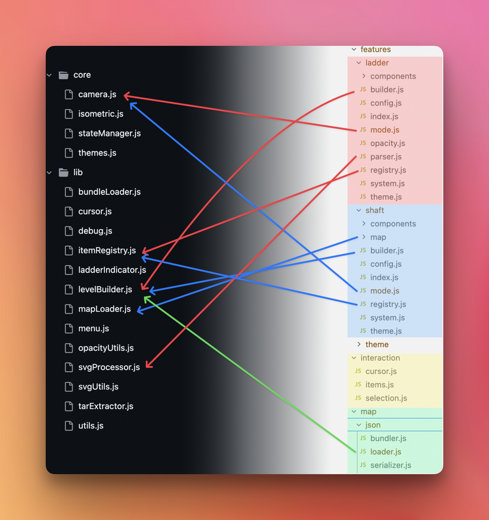

*This entry will be a little bit technical, talking more about the how than the what or why. It covers the less glamorous part of development the foundation work that makes everything else possible.*

The last few coding sessions were not the most exciting to show, because there were no flashy new features or visible changes. But behind the scenes, it was intense. Around twenty to thirty thousand lines of code were edited.

Of course, no one can write that much code in just a few days, so I used AI to help. It speeds things up, but it is not magic. AI is great for quick experiments, yet lasting work still needs experience and clear direction. I have twenty years in software, so it is a big help, but you still need to review, correct, and shape everything yourself.

Since AI can accelerate execution by a huge margin, it also means you can hit a concrete wall very quickly when poor-quality code piles up. That is exactly what happened. By adding the airshaft feature to **Ludic Field**, I broke a lot of existing systems. Displaying several levels together with airshafts caused everything to collapse. So I had to rebuild the core of the viewer from the ground up. About eighty percent of the code is now new. It was tedious work, but the result is a much more modular, reliable, and solid foundation.

You can think of it like reorganizing a messy workshop. Before, tools and parts were scattered everywhere. Now, everything has a proper place. Ladders, shafts, and themes each have their own space, ready to be expanded when needed. It does not make the workshop look more beautiful, but it makes building new things faster and safer.

I know the **map editor** will be much more complex than the viewer. Rather than rushing to stack new features, I decided to invest time into making the system strong and sustainable. The current result is not very flashy, but it is rock solid, and that is exactly what is needed for what comes next.

My vision for the editor is clear: a tool that feels intuitive and incredibly fast for Game Masters. Speed and effort are the two things I always keep in mind. How quickly can you create a playable, satisfying map? How much effort does it take? I want the process to be smooth, quick, and rewarding.

It might not fit every game, since the schematic style leans toward contemporary, modern, and futuristic settings. But that is exactly what I always felt was missing in TTRPG tools. Most map materials are designed for fantasy worlds, and I wanted something different.

There is so much more to come. 

A last word: I want to thank everyone who joined this Patreon and is supporting this journey. It means a lot.
