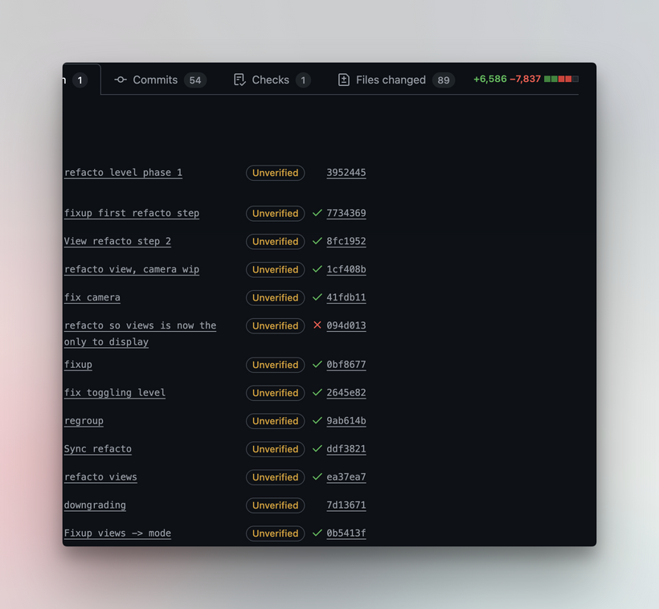

Hey folks,

I went a bit quiet for a week. Not because I vanished, but because the deadline for my first Alien campaign is getting close and I had to switch my brain from “build tools” to “prepare to terrify players”.

There is still a lot to prep. I cannot show everything yet, since some of my players are also here and I do not want to spoil their fun. I have a few props and a small surprise planned for them. I want their experience to feel a bit more engineered than just sitting and rolling dice.

Part of Ludic RPG was also about finding a way to share our sessions that is not the usual TTRPG YouTube format. I get bored fast with those. I have been thinking for about a year about something more edited, more offline, more tailored to an in person campaign. For that I need raw material. So I will record voices first, then experiment.

I am not a sound engineer. After some research and talking with a few friends, I invested in a DJI Mic 3. It is basically plug and play, which is perfect for a rookie like me.

Now, even with the Alien prep, I still found some hours for Ludic Field. Those were the boring hours. The ones that feel like work. Luckily I had good feedback and support from you, which made it much easier to push through.

Here is what changed on the map viewer project.

## 1. Performance fixes

There was an old piece of code that was a bit silly. Every time you moved your mouse, it searched the entire 3D scene to figure out what you were hovering over. That is fine for small scenes. Not fine for what we are doing.

So I added caching.

Then I looked at another bottleneck. We were recreating the same 3D shapes and recalculating the same stuff hundreds of times per second. Same trick: cache it once and reuse. Computers like that.

Result: about 10x to 100x faster. More FPS. Your computer fan will complain less. Your battery will not hate you.

## 2. Untangling the spaghetti

Imagine a restaurant where one person takes orders, cooks, serves and washes dishes. It works, but not for long.

That was our old projection system. It was doing everything. Camera, view modes, animations, building heights, timing. All in one place.

I split it.

- 2D flat view has its own mode.
- 3D isometric view has its own mode.
- Ladder navigation has its own mode.
- Shaft exploration has its own mode.

I deleted and rewrote about 2 400 lines of code that were controlling things like:

- the smooth elevator camera swoop when you click a ladder
- the wireframe animations for vertical shafts
- the timing of what fades or tilts or spins

I also simplified 315 lines of geometric calculations for floor spacing, and I compressed the shaft network code from 1 191 lines to 283. That part felt good.

Last detail that is important for me: I switched the base code from JavaScript to TypeScript. That makes the code safer and keeps me more disciplined. Which is ideal when you work with AI tools that love to bring two units of chaos for one unit of value.

## So what now

Short version: I am in Alien prep mode, but I am not abandoning Ludic Field. I am just balancing the two.

I want to test this future way of sharing sessions, so I will work on recording first. If it turns into something listenable, then it will be hours of editing and experimenting. The game will not be in English though, since I do not DM in English.

Thank you for staying here even when there is a week of silence. Those small supportive pings and feedback about the tools are literally what made me rewrite those 2 400 lines instead of closing the laptop.
