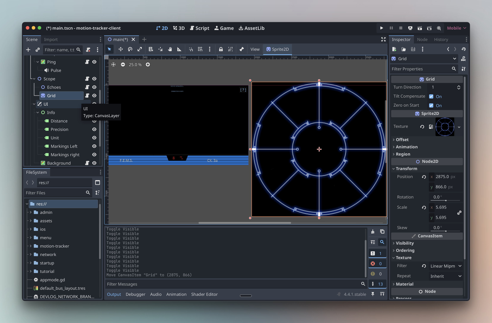

When I was reading the *Alien RPG* book, I smiled at the rules for one very specific piece of gear: the famous motion tracker. I knew immediately that I wanted it on my table.

The idea was simple enough in my head. I would put a [detailed map on the table](/blog/behind-the-scenes-of-my-first-alien-rpg-campaign/#the-ludic-field-map-viewer-on-the-table-setup), place tokens or minis on it, then give one player a phone with a motion tracker app. The player would have to sweep physically with the phone, around themselves or around the miniature, to track movement in the scene.

That is exactly the kind of RPG thing I love. It is sensory. It gives the player an action to perform. It lets the lore and the atmosphere do some work through the body instead of only through description.

So I started my research. Meaning, obviously, I had the horrendous task of... rewatching the movies.

I had totally forgotten that the motion detector concept was already in the first *Alien* movie from 1979. The device is big, almost crude, and the radar interface has this wonderful retrofuturistic electronic look.

Rewatching the saga also made me appreciate the first *Alien* even more. It is so foundational. *Aliens* takes many concepts, images, and scene constructions from it, then turns the dial toward action, soldiers, hardware, and panic.

But for the motion tracker, the iconic one is still the colonial marines version in *Aliens*. Official designation: M314. That thing is burned into my memory.

The interface is one of the best examples of "if an image could be heard." The heartbeat-like pulse scan, the rotating radar, the little beep becoming more nervous when the contact gets closer.

That kind of shared memory is a gift for a GM. You do not need to explain very much. The table already knows what this object means.

So if I was going to build a motion tracker, I wanted this one. Visually and audibly.

## The Prototype

The main idea was simple: one GM phone, one player phone. On the GM side, I opened an admin screen, tapped a direction and a distance, and a contact appeared on the player's tracker. Bingo.

Everything I make for Ludic RPG has to work with consumer devices. It is part of [the mindset I started with](/blog/the-journey-begins/): tools should enhance the table without making the GM’s burden heavier. The phone was the obvious object. The experience has to be fun for the GM and players alike. No hassle, no friction.

And the phone is not only convenient. It is packed with exactly the kind of ridiculous tech I needed. For someone who grew up in the 90s, a pocket object with a screen, speakers, networking, compass, gyroscope, and accelerometer still feels like a dream toy.

For a motion tracker you physically sweep in a 360° arc, that was perfect.

## The tech behind it: why Godot?

A mobile web app was tempting. It would have been easier to develop. But this was not really a web-app problem. It had to run in landscape, feel fullscreen, read movement, and keep input, animation, state, and sound tightly synced. Browsers can do a lot today, but mobile support still comes with quirks. Fullscreen is not always truly fullscreen, and web motion APIs are not as powerful as native sensor software.

Godot kept coming back as the obvious candidate. It is open source, free, lightweight, pretty simple to start with, and it can export to both iOS and Android.

The trade-off is that I had to learn it. Godot 4 is still young, many tutorials are still written for Godot 3, mobile documentation is thin, and the ecosystem is small.

## The hidden price of Godot

A concrete example for this project was motion sensing. If you turn around while holding the phone, the gyroscope may tell you 10°, 60°, 180°, 360°. Then it slowly drifts. This is consumer-grade hardware, built for screen rotation, games, fitness apps, and “good enough” interaction, not scientific tracking.

You can try to fix that yourself with sensor-fusion math. On iOS, that work already lives in Core Motion, and I could not pretend my homemade version was going to beat the people who do this for a living. So the plan was simple: use Core Motion from Godot. That is where the simple plan stopped being simple: Godot does not expose Core Motion directly.

I had to write a plugin to bridge Godot with the native sensor layer. In theory, that is glue code. In practice, making an iOS or Android plugin for Godot is a small tea ceremony, and the documentation is not exactly holding your hand.

Eventually, after some archaeological work, I found the answer in a lost, obscure short video. The recording was rough, and the person’s whole confidence level was: “I have no idea why, but it works.” I was skeptical, but I was also out of options. And it worked. A big thank you to this random stranger.

That is also where AI reached its limit. Claude can be very useful, but with Godot 4 it often mixed versions, platforms, and confident nonsense. It slowed me down.

So the motion tracker was already a strange object: a simple prop for players, sitting on top of sensors, native APIs, Godot quirks, and AI hallucinations.

Very normal hobby.

## The movie-accurate obsession

Once the technical base worked, came the player feeling. That was the part I wanted to nail. The app was running on a phone, not on a replica prop, so immersion had to come almost entirely from image and sound.

### Sound effects

Memory is strange with sound. In some Alien video games, I instantly notice when the pulse rifle does not sound like the movie. The brain does not store a sound like a waveform. It stores a signature: the attack, rhythm, texture, and weight. You do not compare iconic sounds like files. You recognize them like voices.

So yes, I treated these tiny beeps with the seriousness of a crime scene.

I started looping the few seconds of the movie where the tracker appears. I recorded them, studied the waveform, measured the tempo, and timed the rhythm in Godot. Then I went hunting through sound libraries, listening to hundreds of one-second beeps in my headset like a person making very normal life choices.

I even found the sample from the game Alien: Isolation online. They were easy to get, but not the right ones because game uses a different device. So I kept digging, then tuned close-enough sounds with equalization and filters until they had the right tone, dirt, and pace.

### Interface and visual effects

I rebuilt the interface with the same obsession. The radar grid was easy because I found reference images online; the rest was homemade.

I am still not fully satisfied with the CRT effect, but it helps. Your 4K HDR super retina phone screen is proudly trying to make everything beautiful. And I needed the opposite: thin old-TV lines, a bit of instability, an old-school retro-tech feel.

I smiled when I struggled to find the right effect: decades of display progress, and here I was trying to make it worse.

Timing the scan wave was another whole night of work. It reminded me again [why tiny UI motion matters so much to me](/blog/the-small-joy-of-ui-motion/): a few milliseconds can change the whole feeling. While sampling the movie, I noticed a funny detail: the wave does not always move at the same speed from one scene to another. Maybe the shots were slowed down, maybe the prop footage was adjusted for drama. Or maybe there is hidden lore here: *the device has a fast scan mode for when you are in danger, but it drains more battery?*

Either way, there was no single “correct” pace, so I chose the neutral one: the speed that appears most often.

## The problems of the prototype

I already wrote about the first table test in [the previous article](/blog/behind-the-scenes-of-my-first-alien-rpg-campaign/): for the players who knew the movies, the tracker landed beyond my expectations.

What I only teased there was the other side: behind the GM screen, the prototype was trying to kill me. So I did the usual GM thing: manage the disaster and pretend it was pacing.

I had two major issues: **network instability** and **contact-position inaccuracy**. So here I am, fixing these, one problem at a time.

## Fixing the network without adding more friction

### The integrity problem of flexibility

The prototype used UDP broadcast over local WiFi. In plain terms: everyone only had to join the table’s WiFi, an everyday task most people already understand. Then the GM phone shouted small messages across the room, without using the internet. Any locally connected player phone could receive them.

The player opened the tracker and it was already alive. No setup screen. No code to enter. Straight to play. But UDP broadcast has one ugly trait: it does not tell you who is listening, or who actually heard the message.

If a phone locked, slept, changed network behavior, or simply missed the packet, I had no reliable way to know. I could shout the same message again and again, but some networks limit broadcast traffic, and some phones get aggressive about saving battery. Spam is panic, not a proper communication system.

### The solution, and the new problem

There is another well-established network protocol: TCP. It is the obvious answer for reliability: knowing who is connected, sending messages to specific clients, and detecting when the connection breaks. Your everyday apps rely on this kind of connection all the time.

So yes, TCP had to become part of the solution.

The problem is the setup. That is why I did not use it at first. With TCP, one device has to host the connection, and the player phones need its IP address before they can join.

The GM opens the admin app, finds an IP address, gives it to the players, maybe through a QR code, maybe by saying it out loud. The players connect. Then, finally, we play. Yes, but the magic is dead.

It sounds small. Thirty seconds, maybe a minute. But that is exactly why many GMs avoid props. The moment I have to stop the scene to manage the object, it stops supporting the narration and becomes another liability. A good GM tool should give leverage, not workload.

### The trick: use both

So the solution was not to choose between UDP and TCP. It was to give each one the job it is good at.

UDP still handles the first invisible handshake. The GM opens the admin app, and it quietly announces itself on the local network: “My server is up at this IP!” The player opens the tracker, catches that message, and connects automatically.

Then TCP takes over for the real conversation.

The player never sees an IP address. No QR code. No setup ritual. The tracker just opens and starts pulsing, like the prototype did. But behind the scenes, the connection is now explicit and reliable. When the GM places a contact on the admin screen, every connected tracker receives it properly.

And this is magic: we do not want complexity on either side of the GM screen. So the cost has to be carried by development and the build. Two thousand lines of code for reliable magic.

## Fixing the "It works on my iPhone"

The second boring problem was the admin screen. It worked on my iPhone 15 Pro, which was enough for the prototype and absolutely not enough for a public release. On other devices: buttons were cut off, text slipped under notches, panels overflowed. The admin UI was fully broken.

Building for screens has been annoying for developers for a long time. Laptops, phones, tablets, ultra-wide monitors: every new format adds another way for a layout to break. Mobile made it worse, because every vendor has its own mix of screen size, notch, rounded corners, and safe areas.

Thankfully, Godot has responsive layout tools. I knew the concept from web development, but applying it in Godot still meant rebuilding most of the admin screens properly. At least the tracker view was simpler; it is just a single focused screen.

## The next big problem: compass drift

The rebuild is not done, but the app is already much closer to something I can give to other tables without becoming technical support in a Weyland-Yutani blue shirt.

The network is more reliable. The admin panel adapts.

But one problem is still waiting for me: contact-position accuracy. Because even if every phone receives the signal, that only solves delivery. It does not solve direction. If I place the echo north-east of the players, every tracker has to agree where north-east is.

Well, I discovered that is not guaranteed.

That is the compass drift problem. It took several nights and a few long discussions with friends to find a possible solution, because the answer changes depending on the setup: same table or remote play.

This funny nightmare deserves its own post. Stay tuned!
