The Alien RPG rules obviously included the famous motion tracker. This devices that created cult scenes across the franchise.

The concept was on the first movie
--

For my first in-person Alien campaign, I wanted one very specific thing: the motion tracker from *Aliens*.

Not a menu.
Not a companion app.
Not a clever dashboard with six settings and a login screen.

I wanted to hand a player a phone and make it feel, for a few seconds, like they were holding the real thing.

Green sweep. Dark screen. That anxious little scan sound.

Then: **BEEP.**

Something appears.

That was the whole promise. A tiny prop moment, but one that could change the room.

I could not find the exact thing I wanted, so I built my own. At first it was just for my table. Then I shared a short demo on Reddit, and people immediately started asking if they could use it too.

That was encouraging. But the real test was still the campaign.

At the table, it worked.

Players leaned in. They turned with the phone. They watched the sweep. The little echo on the screen became something to worry about.

That is when I stopped thinking of it as a one-off prototype.

And that is also when the prototype started showing me everything that was still wrong.

## The Prototype Worked. Mostly.

The setup was simple: one GM phone, one player phone, same WiFi.

The player opened the tracker. No account, no lobby, no pairing ritual. Just the radar, already pulsing.

On my side, I opened an admin screen, tapped a direction and distance, and a contact appeared on the player's tracker.

Most of the time.

That "most of the time" is the problem.

For a prototype, it was fine. It proved the feeling. It proved that a phone could become a table prop instead of another piece of software asking for attention.

For something I can give to other tables, it is not fine at all.

The prototype had two big weaknesses:

- **Network stability:** sometimes the contact never reached the player.
- **Contact accuracy:** sometimes it appeared, but not quite where I intended.

Both problems hurt the same thing: trust.

If the GM triggers an echo and nothing happens, the scene stumbles. If the echo appears in the wrong direction, the tension becomes confusion. The player does not think, "Ah, an interesting networking edge case."

They think the prop lied.

That is why I started rebuilding it.

## Why I Built a Phone Prop in Godot

The app is built with **Godot**, an open source game engine.

That may sound slightly weird for a phone prop, but the tracker is not really a normal mobile app. It behaves more like a tiny game object: animated, atmospheric, reactive, and synced between devices.

It needs a smooth radar sweep, sound timing, phone orientation, local multiplayer behavior, and a UI that feels alive without asking the player to operate it.

A game engine made sense.

I could have gone native with Swift on iPhone and Kotlin on Android. That would probably make some parts cleaner. It would also mean building and maintaining the same experience twice.

Godot gives me one codebase, real-time animation, cross-platform export, and multiplayer tools.

The trade-off is that Godot 4 still feels young in some corners. I had to learn GDScript. Many tutorials are still written for Godot 3. Mobile examples are often desktop ideas wearing a phone costume. And when I needed something very specific, there was not always a plugin waiting politely with the exact solution.

So yes, it slowed me down.

But the choice still feels right.

This app lives or dies by atmosphere and timing. Godot is good at those.

## The Part That Cannot Feel Like Software

The motion tracker has one brutal requirement:

> The GM places a contact. Players see it. Immediately.

If that fails, the GM is suddenly debugging a mood.

And the GM already has enough to carry: description, rules, pacing, music, lighting, player questions, jokes, pressure, panic, the next corridor, the next clue, the next bad decision.

The tracker cannot become one more thing to manage.

The prototype used **UDP broadcast** over local WiFi.

In plain terms, every phone sits on the same private WiFi network. The app does not need the internet. The GM phone and the player phone talk through the local router, inside the room.

That made the first version feel wonderfully simple. The player opened the tracker and it was already alive. No setup screen. No "enter this code." No one had to become the network administrator of their own horror scene.

The GM phone just shouted a small message across the local network. Any player phone listening could receive it.

Fast. Invisible. Perfect for immersion.

Except UDP broadcast is basically shouting across a room. It is convenient, but it does not tell you who heard you.

If a phone locked, slept, changed network behavior, or missed the message for any reason, the app had no reliable way to know. I could shout the same message again and again, but that is not a system. That is panic with a loop.

Some networks limit broadcast traffic. Some phones become aggressive about saving battery. Some messages just disappear into the tiny domestic void between "it worked five minutes ago" and "why is this not working now?"

UDP broadcast is great for discovery.

It is fragile for important game state.

So I changed the model.

The app now uses **TCP** for the real connection between devices. TCP establishes an explicit link and keeps track of it. The devices know they are talking. Messages have a path. If the connection breaks, the app knows.

That gives me the reliability I need.

Of course, it creates a new problem: setup.

If the GM has to create a server and the player has to manually connect to it, the magic is gone. The player is not holding a motion tracker anymore. They are configuring software.

So I kept UDP broadcast, but only as the invisible handshake.

The GM opens the admin app. It silently starts a local server.

The player opens the tracker. The radar appears immediately, already pulsing.

Behind the scenes, the GM device broadcasts one tiny message:

> Here is my server. Connect to it.

The player app catches that message quietly, then establishes the stronger TCP connection.

The player never sees any of this.

That is the whole point.

At the table, play is messy. Everyone may start together, phones raised, ready for the tracker moment. Then the GM describes the corridor, players argue about strategy, someone lowers the phone, someone locks it by accident, someone asks whether flamethrowers are really a good idea indoors.

The reliable connection is for that messy middle. It lets the prop survive normal table chaos without asking anyone to think about networking.

For the player, the experience should still feel like the prototype.

Behind the scenes, it took about **2,000 new lines of code** to keep it that simple.

The players see a beep.

I see a support ticket with sound effects.

## One Screen Is Not a Product

The tracker view already worked well on my iPhone.

The admin panel did not.

For the prototype, I rushed it. It fit my iPhone 15 Pro well enough, and that was good enough for my table.

Then I tried other screens.

Immediate humility.

Buttons were cut off. Text slipped under the camera notch. Panels overflowed. Menus sat too close to the home indicator. A layout that looked perfectly acceptable on one phone became ridiculous on another.

Mobile screens are annoying in very concrete ways: small phones, big phones, iPads, notches, rounded corners, portrait, landscape, safe areas that do not care about your beautiful little panel.

So I stopped designing for my screen.

The admin interface now adapts. Controls stay away from notches and home indicators. Panels resize instead of spilling out. Buttons are large enough for thumbs. The GM side should survive real devices instead of only surviving my pocket.

This part is less cinematic than the radar sweep.

It is also the part that decides whether another GM can actually use the thing.

## What Still Scares Me

The rebuild is not done, but the base is much stronger now.

The network is reliable. The admin panel adapts. The app is closer to something I can give to other tables without standing next to them like technical support in a Weyland-Yutani hoodie.

Now comes the problem I kept postponing: **compass drift**.

Because even if the network works, the tracker still has to answer one horrible question:

> Do all phones agree where the echo is?

Right now, not always.

That one took me a few days to think through.

Next devlog.
