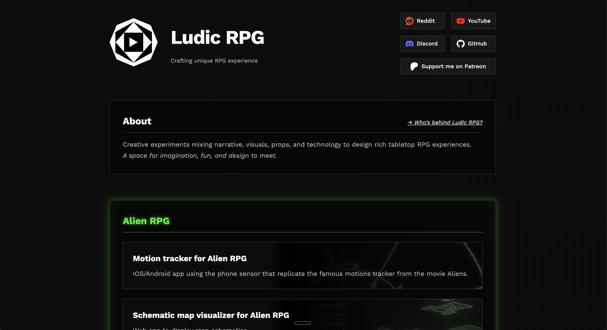
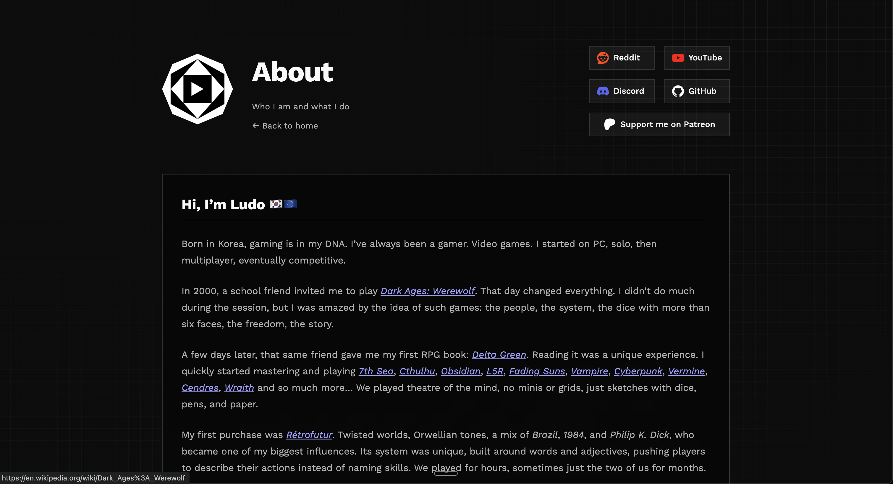
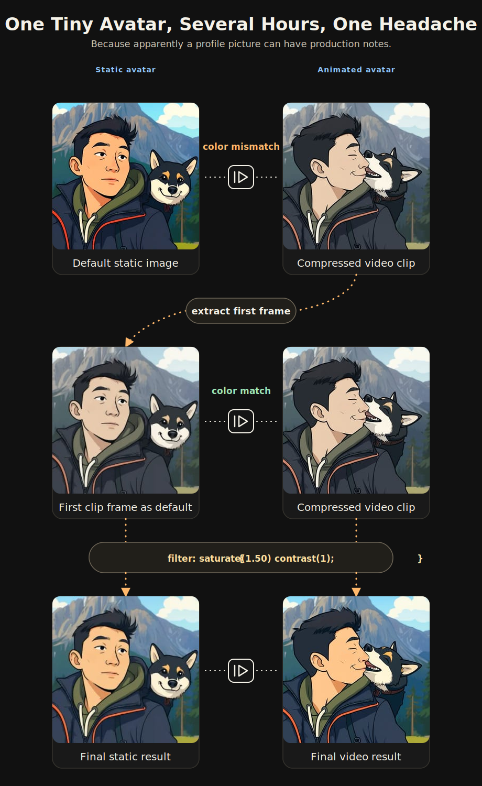

I wanted to post about the new [Alien Motion Tracker update](/blog/building-the-alien-rpg-motion-tracker-immersion-without-friction/). That was my original plan. Then I opened my Patreon, looked again, and remembered why I was slowly moving away from it.

Patreon helped Ludic RPG at the beginning. This is still a side project, and the first follows, the few reactions, or a single short comment can give you enough motivation to continue.

But the platform also kept the work in a closed place. Everything lives inside Patreon: the post editor, the media, the audience, the sharing, the discovery. I understand the need to protect creators' work, but when I could not even properly export my own posts or download my own video, it started to feel wrong for Ludic RPG.

The project is about making my experiments accessible to most, tangible, and easy to share. The writing should be findable too: through links, search, and whatever the next version of the web becomes.

So the first question was simple and annoying: if I stop using Patreon as the main place for posts, where do I write?

I thought about Notion too. I used it a lot in the past, and for years it filled a real gap: comfortable writing, decent reading, easy organization. But it had the same problem as Patreon. The content lives inside its own weird format, exporting pages and databases is messy, and I would still be building Ludic RPG inside someone else's box.

## The answer was probably my own website

The plan did not include building a blog system. The first Ludic RPG website was doing a very small job: a single page with all my links. A homemade linktree.

Back then, a good friend recommended [Astro](https://astro.build/) to me for this little static webpage. I didn't know it, so I started to dig a bit more and discovered a feature called [content collections](https://docs.astro.build/en/guides/content-collections/). Basically, Astro can treat a folder of Markdown files as structured content and turn those files into pages.

This is attractive because Markdown is a lovely text markup, and a very popular one. You use it everywhere: on Discord, for instance.

```markdown
## This is a section title
### Subtitle

**Bold text** and *em* text

[Click here](https://ludicrpg.com) 


```

But as you can see, writing a title is just typing the `#` character. That's fine. Adding an image is where it gets annoying: I would have to place the image in the right website folder, copy and paste the image path inside the Markdown article file, then add the brackets and parentheses around it.

I wanted a comfortable writing experience where I could just drag a picture into the article and keep my focus on the content.

The missing piece was Obsidian, suggested by the same friend who has been responsible for a suspicious amount of "small advice" that later became several evenings of work.

## Obsidian made the local workflow click

Obsidian is basically a personal knowledge base, but the important part here is that it stores notes as Markdown files on disk. Real files, in real folders. That means I can make an Obsidian vault point directly to the folder where my Astro site expects the blog collection content to live. 


I write in Obsidian and the website already has the article. There is no extra login, no manual copy-paste from one editor to another, no platform-specific format to escape later. It is boring, but in a very good way. The article is a file. The images are files. The website builds from those files.

The part that needed more care was assets: images, screenshots, photos. When I write, I often drag and drop screenshots, remove them, replace them, try another image, change my mind, and then forget which screenshot was the useful one. If every article image goes into one global folder with every other website image, it becomes impossible to keep clean. After twenty posts, there are dead screenshots, unused covers, old test images, and no easy way to know what belongs to what.

So I fine-tuned the Obsidian vault and the Astro blog structure. Each article has its own folder, with its own `post.md` and its own `assets` folder:

```text
2026/
  05-20_ludic-rpg-site-v1/
    post.md
    assets/
      ludic-rpg-site-v1-home.png
      ludic-rpg-site-v1-about.png
```

Now, when I drag a picture into the article, Obsidian saves it next to the article, inside that article's assets. The Markdown link points to the local file, Astro renders it. If I delete a draft one day, I just delete the whole folder. It is a small workflow detail, but it removes a lot of friction.

To get nice URLs for search engines and link sharing, Astro is configured to remove the date, the year and the month-day, from the article URL. So the link is https://ludicrpg.com/blog/ludic-rpg-site-v1. You can see it by yourself in your browser address bar now.

Finally, to publish, I just deploy the site. It is pretty straightforward with GitHub and Cloudflare.

## A great reader experience

I'm obsessed with experience, good ones. So if I was going to build my own blog, I wanted to give readers the same kind of attention. I'm convinced that experience matters anywhere; this is how I convey deliberate intention in anything I craft. Behind the screen, I am a game master; behind the desk, I was a webmaster for too many years, back when the web guy was somehow expected to fix the printer too. It left me with a few reflexes I cannot turn off.

Reader experience has research, measurements, and [standards](https://www.w3.org/TR/WCAG21/#visual-presentation). It looks simple, but it is a surprisingly deep topic rooted in the biology of the eye and brain. The blog had to provide the best reading experience I could make, and that depends on:

- font choice: <strong style="font-family: 'Noto Serif', 'Source Serif 4', Georgia, serif;">serif</strong> or **sans-serif**, font weight and font-size, and font size hierarchy (title, subtitle, body): [Major Third, Perfect Fourth, Golden Ratio](https://www.modularscale.com/)
- background and text color choice & contrast
- total character per line, character spacing, word spacing, line height, line spacing, 
- space between paragraphs and around paragraphs, which varies depending on screen size.

All these factors change depending on your screen size. Your eyes do not read a phone screen the same way they read a large desktop screen.


Since I'm rusty, I went to check the grand masters of readable pages: The New York Times, [BBC](https://bbc.github.io/gel/foundations/typography/#fn4), Medium, Substack. They have spent considerable effort over the last 15 years optimizing for reading and web performance. And it shows.

Two small compromises I made:

- **I used the sans-serif font Inter**. It's a solid free sans-serif font for readability. Even if it is not consistently proved, there is a slight preference in some reading discussions for character recognition with serif fonts. 
  
- **Dark background.** Human eyes often read better on a light background, mostly because a bright page increases the screen's overall luminance. In good lighting conditions, this factor matters less.

I also opted for a full distraction-free layout. Nothing should pull the eye away from the article: no abstract pattern in the background, no border around the text, no decorative frame. The content, the text. And if there is navigation, it should disappear as soon as you start reading.

I fine-tuned the page for mobile, tablet, and desktop individually, so any screen size gets a comfortable reading moment.

## The blog link broke the old homepage

Once the blog was done, I had a very simple task left: add a blog link to the Ludic RPG homepage.




That is where the old site started to show its limits. The homepage had never been designed as a real website structure. It was a landing page. It had some links, a short message, a few social buttons, and not much room for a real navigation model.

I tried the obvious small fixes. Maybe I could remove the Patreon link and put the blog there. Maybe I could move one button. Maybe I could adjust spacing and pretend this was enough. Nothing was satisfying.

So I started with the header. Then the header made the About content feel too large for the homepage. Then the About content wanted its own page. Then the homepage needed to explain Ludic RPG more clearly. Then the project cards needed to feel like real entries and not just a small pile of buttons. At some point, the small blog link had quietly become a full rebuild.

## Meaning is everything

I also paid very close attention to semantics. I was really into web semantics back in 2005-2010, when the web became big enough that we started to care more seriously about how information was written, structured, and understood online. Around the same time, accessibility became impossible to ignore: making sure people with disabilities could reach the same information equally.

Semantic HTML means every piece of content carries a role or intent. A title should be marked as a title. A publication date should be marked as a date. An image with a caption should be marked as a figure. This sounds obvious, but it matters a lot for browsers, search engines, screen readers, and any tool trying to understand the page.

```html
<article>
  <header>
    <h1>Why Ludic RPG needed its own home</h1>
    <time datetime="2026-05-20">May 20, 2026</time>
  </header>

  <figure>
    
    <figcaption>The new Ludic RPG home page.</figcaption>
  </figure>
</article>
```

Compared with:

```html
<div>
  <div>Why Ludic RPG needed its own home</div>
  <div>May 20, 2026</div>
  
</div>
```

Both look exactly the same on screen for a human. But only one explains itself, its structure, and its meaning.

In 2009, I even ended up in a task force with researchers and industry people working on semantic education formats for the web, which is probably why I still get suspicious when a page is just a pile of pretty `<div>` tags. So, yes, I care about this maybe a little too much. But meaning is not decorative. It is part of making the site readable, accessible, findable, archivable.

I pushed even further with JSON-LD metadata. It is invisible to the human eye, but machines can read it: crawlers, search engines, AI agents, archives, and other tools trying to understand what a page is about. It carries relationships between things: *Ludic Field is a tool, made by Ludic RPG, created by me, about TTRPG maps and immersive tabletop play, and part of the larger Ludic RPG website.*

```json
{
  "name": "Ludic Field",
  "@type": "SoftwareApplication",
  "applicationCategory": "GameApplication",
  "operatingSystem": "Web browser",
  "url": "https://field.ludicrpg.com/",
  "publisher": {
    "@type": "Organization",
    "name": "Ludic RPG"
  },
  "creator": {
    "@type": "Person",
    "name": "Ludo",
    "alternateName": "Glitch"
  },
  "about": ["interactive TTRPG maps", "GM tool"],
  "isPartOf": {
    "@type": "WebSite",
    "name": "Ludic RPG"
  }
}
```

In these messy early years of the AI era, this matters even more. Machines are still dumb in very creative ways, so giving them structure is a nice little help instead of hoping they guess correctly. I adapted this metadata for every page: blog, about, projects...

## Making Ludic RPG visible

> Content is king, Linking is queen

That was the credo back in the golden era of Google PageRank. It meant that if you wanted people to find your content, you had to write something worth reading first, then make sure a lot of reputable websites would reference it with links.

Linking strategy also happens inside the site, and internal linking is often mistakenly overlooked. Navigation extends far beyond the header and the footer. A website also has a quiet internal map: links between articles, tags, topic pages, related posts, RSS, sitemap, and all the small paths that help a reader, or a crawler, understand where things belong.

Tags might look like a cringe concept for a human reader: `#alien-rpg` or `#ludic-field` can feel obsolete. But tags are also links, and each tag points to a hub page. If you click `#alien-rpg` you land on https://ludicrpg.com/blog/tags/alien-rpg/, with all the Alien RPG content I wrote in one place.

It looks simple, almost dumb. But that page has a focused title, description, reusing a list of existing articles, breadcrumbs, and structured metadata. In the old SEO lingo, we call this a honeypot: a page that strengthens one specific topic and gives it a clear place to exist.

Ludic RPG is not a marketing thing. I will not spend precious effort writing thousands of targeted pages around the stuff I do. But with devlog articles, and a few cheap tricks, I can get more value out of it and maybe a game master searching for Alien RPG props, modern RPG maps, or GM tools could find my work when it is relevant to them.

## Trends kill identity

I really started as a web designer. That was my first love with the web: making things beautiful, unique, and expressive. I cannot count how many websites I made for esport teams, communities, RPG groups, or myself. Later, I worked in a small marketing agency where artistic creation and originality were the main differentiators.

When it comes to aesthetics, trends kill identity. There are some scary signals around this. 


*Image credit: [The Culturist, "Why Is the World Losing Color?"](https://www.theculturist.io/p/why-is-the-world-losing-color)*

Look at [everyday objects, cars, interiors](https://www.youtube.com/watch?v=tUgceJbZ598), devices, and interfaces. A lot of the visible world has become flatter, more neutral, more boring. Music has its own version too. When everyone optimizes, the edges disappear.

Websites have the same temptation. Twitter Bootstrap, Material Design, Shadcn with Vercel, and recently Apple Glass-style interfaces all pre-work part of the style for you. Some of these systems are extremely useful. They give fast answers to real UX problems. They make functional web apps easier to build. They also give a minimum level of aesthetic quality to people who are not designers.

But trends kill identity, uniqueness, and flavor. Of course, a website needs familiar navigation. A standard experience is more valuable than inventing a clever menu that fights every habit. A human thumb also needs roughly the same target size on a mobile screen to tap a link comfortably. So position, placement, and size will often converge in any proper web app.

That means the designer has fewer levers to express and differentiate. The effort becomes even more costly for more subtle but impactful results.

For Ludic RPG, I defaulted to my easy color scheme: black and white. I am probably biased by the same neutral environment I am criticizing here. It was a lazy choice at the start, because I know the crazy amount of effort it takes to find a color palette that suits me and still looks decent to others. 

I will not describe every page change here, because you can see the result by navigating the site. The challenge was making a limited palette feel intentional instead of default, through typography, spacing, images, rhythm, disappearing borders, subtle gradients, and framing.

## A tribute to motion

My true calling might be 2D motion design. Early on my web-designer path, I became obsessed with making things move: websites, games, animated clips. One of my proudest old creations has probably disappeared into the aging memory of the web: a website for the C.O.P.S. RPG, full of animations, parkour silhouettes, urban jungle shadows moving in the background, a grizzly roaring. Endless nights of work.

### Small motion, everywhere

I could not leave Ludic RPG without that touch. I did not have weeks to animate everything by hand, and AI saved my ass a little there. You can see small movements across the site: logos shaking, icons breathing, little elements refusing to stay completely still.

### The avatar trick

The avatar with my doggo became the main playground. I started from a real photo, manually edited the background, then pushed the image toward a cel-shaded / rotoscopy style. Once the still image worked, I used Midjourney animation and generated probably hundreds of short clips before keeping seven that looked acceptable and nice.

On the site, those clips play like small surprises. The base avatar is a static image that can animate spontaneously, and it also has an exclusive animation when you interact with it. Motion can become distracting, and too much is annoying, so every five seconds a script rolls a chance to play a new clip. If it fails, the next roll becomes easier, so eventually you should be lucky enough to see one or two animations without hating them.

Then came the boring part: file size. I compressed the clips hard so they load fast, roughly 1.4 to 1.8 MB each, the weight of a large image. Compression is no magic, so it also altered the colors. The static profile picture and the video clips no longer had the same tone, which broke the illusion of continuity.



To fix that, I took the first frame of a compressed clip, isolated it, and used it as the default static profile picture. The still image and the videos finally lived in the same color world.

New problem: it looked dull. The compression had removed too much saturation, and the avatar looked faded, almost sick. A little funeral-picture energy. Not cool. I am old, but I am not dead yet.

So I used CSS filters, the same web styling language I use to style the buttons, text colors, layout of the site, to push saturation and contrast back into the image and clips. Small trick, big difference.

I also had to protect mobile users. The script respects reduced-motion preferences, skips video when data saver or slow mobile connections are detected, and limits how many clips can load on mobile. Motion should add life, not punish your phone plan.

## Ethics are part of performance

All the work above went through a careful performance pass: assets, fonts, file sizes, rendering cost, CPU effects. The goal was simple: any device, on almost any network, should still get a decent experience.


This can become endless. You can always micro-optimize more: limit a font to the characters you actually use, serve it yourself, remove one extra network call, reduce one more asset. But this is also where performance and ethics start to overlap. Serving fonts locally is faster, but it also avoids calling Google just to display text.

Videos are a whole other beast. I publish videos to demo my work, and I spent enough of my career around extremely low-latency video to know how deep that hole goes. Video hosting looks simple from the outside. Then you touch it and lose three months.

For a small creator site, YouTube is hard to beat: free, efficient, familiar, discoverable, and no bill per minute watched. The trade-off is privacy. A normal YouTube embed calls the player before you even choose to watch anything, which is not ideal in Europe, land of GDPR and "please consent to eat my cookie" popups.

So I built a small Astro facade. The article first shows a local cover image and loads the privacy-enhanced `youtube-nocookie.com` YT player only when you press play. To keep the Obsidian flow comfortable, I also wrote a script that downloads and crops the YouTube thumbnail automatically, plus a small preview component so the video still looks nice while I am writing.

It's a win for privacy, but also for performance, since I no longer preload the heavy YouTube player every time. For videos, the site makes zero third-party calls until you press play.

## Owning the experience

Finally, I probably got lost on my way, but that is also the point. Owning the blog, and the site around it, means being responsible for the experience you get here. And since experience is the main focus and promise behind Ludic RPG, the site had to become part of that journey too.

Moving away from Patreon also means losing the comment section, the tiny *like* counter, and the little signs that someone is reading. I might fix that one day, but of course, that is more work again. In the meantime, your support and feedback genuinely fuel my motivation to keep working on these projects. If you want to show appreciation, joining the Discord, subscribing to the YouTube channel, sharing the links around, or following and upvoting the Reddit threads are small gestures, but they mean a lot to me.
