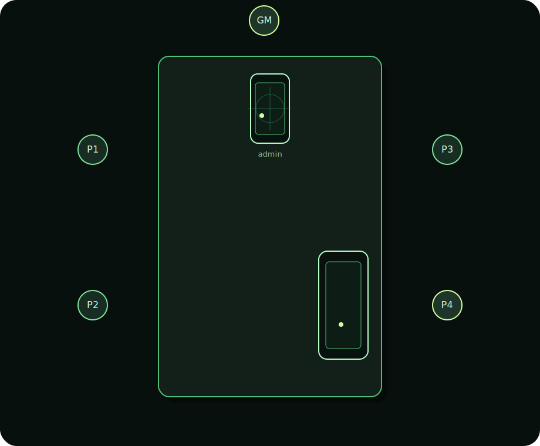
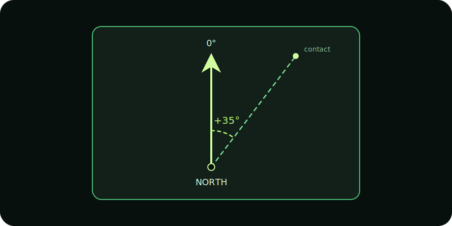
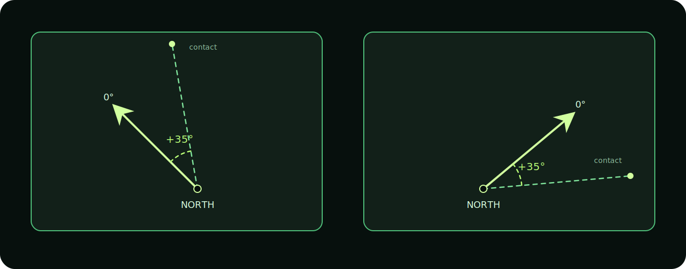
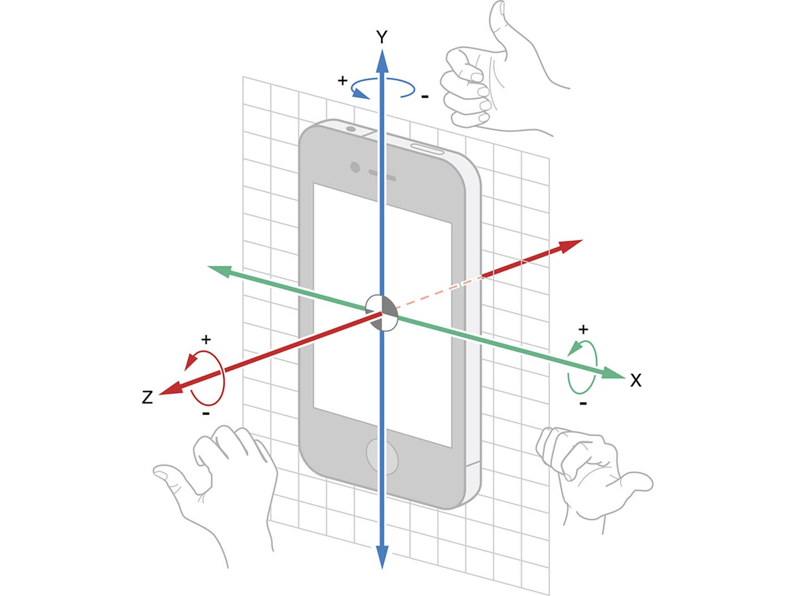
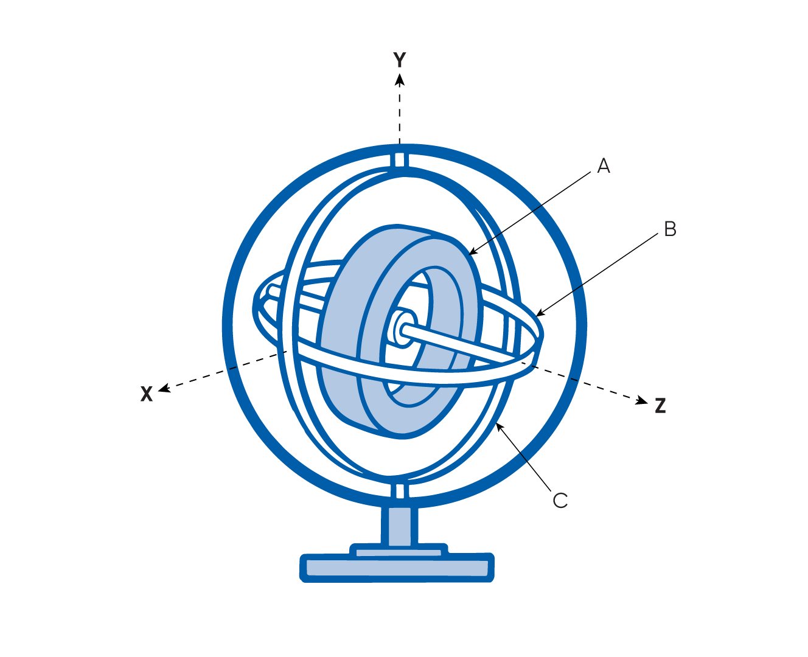

I explained in my [previous article](/blog/building-the-alien-rpg-motion-tracker-immersion-without-friction/) why I rebuilt the network layer of the alien motion tracker app. It was fragile, but it was not the main issue.

## The table problem

To understand the real problem, I need to explain how the app works. The app is currently designed for in-person play, so imagine a classic TTRPG table with the GM at one end and the players around it.

To avoid tedious setup, it has to work from any side: the player may be sitting left, right, or even moving around with the phone.

On the GM side, there is a hidden admin panel with a radial grid. The grid is split into the Alien RPG ranges: short, medium, and long, with meters attached.

When the GM taps it, the app sends a message to the player phone: "Motion detected at +35° at a 12-meter distance".

Displaying the echo at the right range is simple enough. I take the bottom center of the tracker screen and place the echo with a bit of math based on the screen height.

## +35° from what?

For the angle or the direction of the echo, the GM phone and the player phone need a shared reference. They need to agree where zero is. 

My first answer was obvious: use the compass in the phone. Phones have a magnetometer, which reads magnetic fields to estimate where north is. This is how a map app can know which way you are facing and rotate around your position.

North is a pre-made agreement. Centuries, maybe millennia? Conveniently old. The GM and player would not have to define anything. They would start the app, network code would auto-connect them, and both phones would already share one common direction. At least, that is what I hoped.

## The indoor compass problem

Indoors is where the idea started falling apart. A room is full of magnetic interferences: electronics, phones, laptops, routers, appliances, metal materials. I had never really played with a phone magnetometer before, so I did not know how much this would perturb where each phone thinks north is.

The documentation I found was purposely vague about precision. It said I could expect about +/-30° of drift. At first, I thought that might be acceptable for a TTRPG prop. I made my first mistake there: the drift is per phone. With two phones, +/-30° can become +/-60° of disagreement, which is already a lot.

In practice, local magnetic perturbation was even worse. From a few meters away, one phone could drift up to 90°. With two phones involved, that can mean 180° of error. That means I'd put an echo on my grid, and it would be in the opposite direction for a player.

This is where the magic fails and the prop becomes a liability for the GM.

To fix it, I needed another reliable common reference. That meant changing the experience. The phones now had to be synced together before play, just long enough to agree on a shared zero. It sounds tiny, but it adds friction during the session: a few seconds of pause, trying to make the prop work.

Also, because magnetic perturbations are local to each seat, and different again if the player moves around the table, I could not rely on the magnetometer anymore.

## The gyroscope to the rescue

So which sensor was left?

A phone has a few motion sensors, but the magnetometer was the one I could no longer trust indoors. The accelerometer can help with movement and tilt, but the gyroscope was the interesting one. It detects rotation on three axes: pitch, yaw, and roll. And the motion tracker is exactly about yaw: the player sweeps the phone around to detect contact in 360°.

The gyroscope has one big weakness: no fixed reference. If you rotate your phone, it can sense a +86° change, but only from its current starting point. Put the phone back in your pocket, open it later, and that starting point may be different.

So I had to introduce a calibration step. Both phones need to be put flat on the table and pointed in the same direction: an edge of the table, for instance, or a wall. From there, both phones can define the same reference: "this rotation is our shared zero." When the GM phone sends +35°, the player device knows where to start counting.

The gyroscope is not perfect either. It drifts: a full rotation might read 359° or 362°, and those tiny errors can stack. But compared to indoor magnetometer chaos, it was good enough for a TTRPG prop.

The real work was making it stable in real hands. No one holds a phone perfectly flat or sweeps at a fixed speed, so I needed fused motion data from several phone sensors. Godot did not expose what I needed, so I had to bridge to the native iOS and Android code.

Then comes the table reality check. A phone can lock. It can go to sleep. A player can open a message. The GM can leave the app to change the playlist. That is where the code grew. I ended up testing more than 20 scenarios around locking, reconnecting, interrupted calibration, and sessions left sleeping for hours. It is a lot of boring effort for a weird misaligned "north" problem. But again, this is the whole point: complexity belongs in development, not in the GM's hands during play.

## So what now?

I have tested the app extensively on two iPhones, and it works flawlessly so far. It's solid. There may still be some super edge case hiding somewhere, but I have spent more than three days chasing them. Now I need to polish the interface, make the screens more lore-friendly, and package the app for release.

For now, the app is designed to handle one motion tracker per table. I think that is enough. Adding more phones would mean placing the players on a virtual map, then calculating echoes and distances between them. That is a whole other beast, and it would be hardcore for a GM to manage on a phone.

But on desktop, it starts to make a lot more sense. This new version relies on a shared table reference instead of magnetic north, so it is already closer to working with a desktop app. That is big, because we already have the [Ludic Field TTRPG map viewer](https://field.ludicrpg.com/).

Good news too: the code seems compatible with Android. I would need to adapt the sensor-specific parts, and I have never shipped an Android app in my life, so I hope there is no bad surprise waiting there.

I also thought about Virtual Tabletop usage, but I cannot really see how it would work. If you are in front of your computer and the tracker asks you to sweep around you, what happens when motion is behind you? Do you turn your chair away from the screen? The prop feels built for a physical table, not that use case. If you have an idea for it, share it on Reddit or [Discord](https://discord.com/invite/WYQMvQcYgP).

Release is coming soon!
