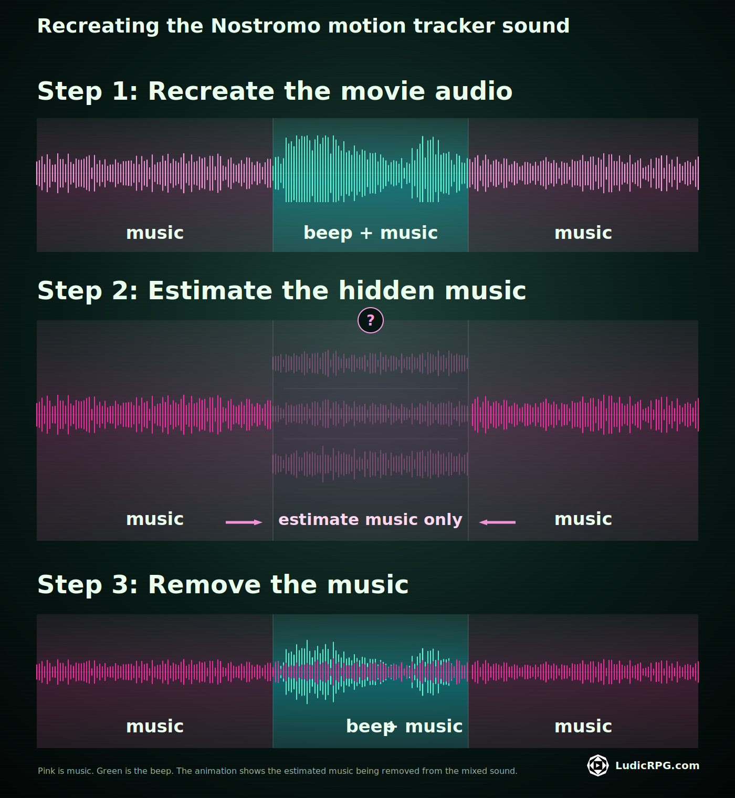
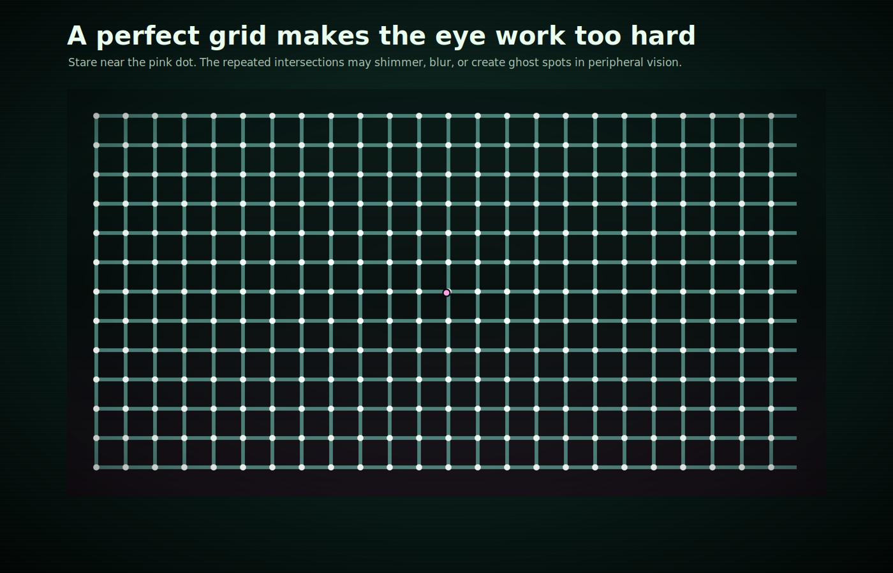

I really like the aesthetic of Alien 1979. It has this strange, unique retro-tech style. The first motion device in the movie looks so rudimentary that I thought adding it to the [Alien Motion Tracker app](/alien-motion-tracker/) would be quick.

I could not have been more wrong.

## Figuring out what the movie never shows
There is not much information about this motion detector, so I had to invent a lot of missing behavior.

The gameplay feels surprisingly different, because the tracker shows a full 360-degree view around the player instead of a forward 180-degree arc.

But the movie does not answer some practical questions. What happens when you rotate the phone? How does a signal move on a rigid grid? If you do it too literally, pings just jump from cell to cell. Moving pings are worse: rotate the phone, and the tail suddenly points wrong.

So I took a few liberties with the rotational sweep. That fix gives this device its own slightly quirky gameplay. It will be available in the next version. Below, you can see what happens when the player rotates their phone.

## Recreating the exact sound from 1979

The sound was the biggest challenge because the movie never gives you a clean beep. It is always mixed with background music, and the original effect probably came from one of those very specific 1970s synthesizers only old-school music producers still have in their studio.

Unlike the Alien: Isolation theme, where you can find dozens of sound files, this one had nothing. I searched through the last pages of Google and old forum threads for days, and I could not find anything even slightly close.

So I had to recreate it from scratch.

Finding the pitch was easy. The attack, the filter, the exact electronic bite of it... that was the problem. No matter the tool I used, it sounded like a beep, but not like the beep from the movie. I am not a pro sound designer.

So my last chance was to isolate the beep from the music. Suddenly, I was very glad to have a bit of signal processing knowledge left in my brain. Most of it came from image and video compression, but digital sound lives in the same strange family of problems.

Since the background music is continuous, and can be heard before and after the beep, I could use those two parts to estimate what the music would have sounded like without the beep. Then I could subtract that estimate from the movie audio.

In reality, it took several attempts to find the right estimate of the music. After probably 30 or 40 variants, I finally had the exact electronic beep for the Nostromo theme. And because I compared it more than a hundred times, I know the timestamp by heart now. Check around 0:41 in the movie if you're curious.

## Making the grid stop fighting the human brain

Another funny issue with the Nostromo theme is the grid.

Human eyes are bad with grid patterns. Grids become a trap: the eyes keep making tiny movements, the brain keeps boosting edges and contrast, and suddenly the grid starts to blur or feel like it is moving.

Nothing is animated. The brain is just trying very hard to read a repeated pattern and accidentally creating a little visual mess.

You can check the [grid illusion](https://en.wikipedia.org/wiki/Grid_illusion) or [Troxler's fading](https://en.wikipedia.org/wiki/Troxler%27s_fading) if you want the academical version.

The trick was to break the perfect pattern visually. I iterated on the grid several times, until watching it felt stable enough for me. Maybe not for every human, so let me know if you have issues with it.

Since the goal is immersion, the effect also had to feel plausible for the device:

- the grid lines are not perfectly straight everywhere
- the line colors vary slightly, with a central disc to break contrast
- some lines are thicker, which creates a small sudoku effect and breaks the pattern too

Ironically, in the end, it is not really a perfect geometrical grid anymore. It is an illusion of a grid, rebuilt just enough for the brain to accept it as one.

So yes, the Nostromo device only "looked" like the easy one... But it's done, and I'm happy to have this proper tribute to the franchise available.

By the way, the [closed beta started](/alien-motion-tracker/) and it was quite something! I'll write about this in my next post, with more detail about the code behind the app.
