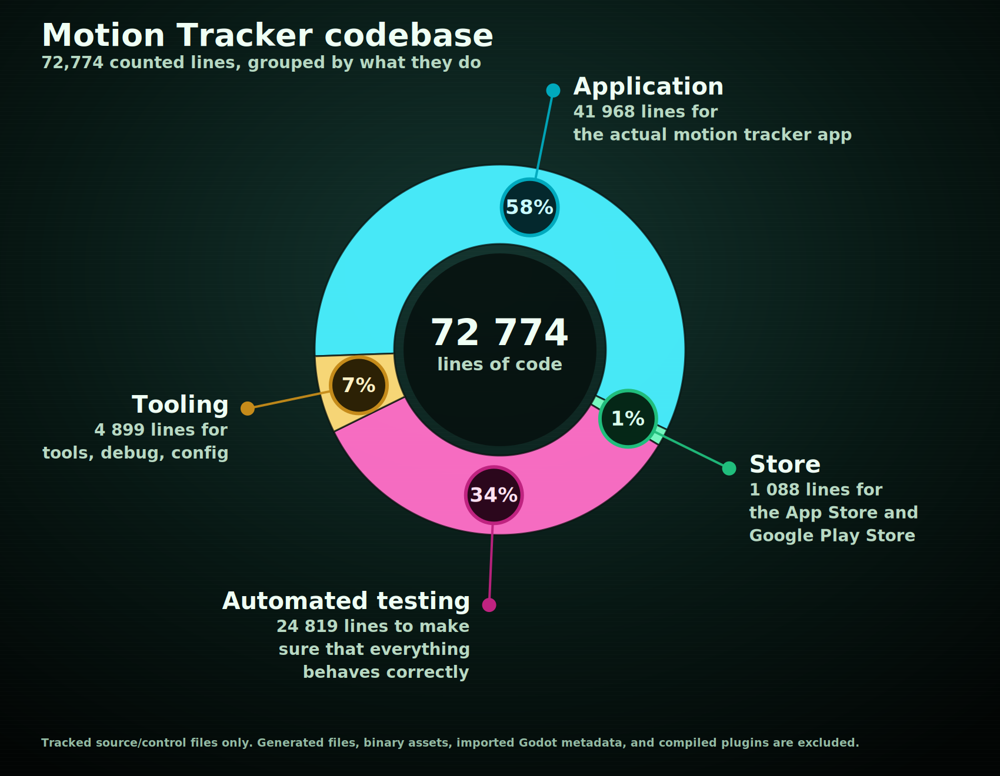
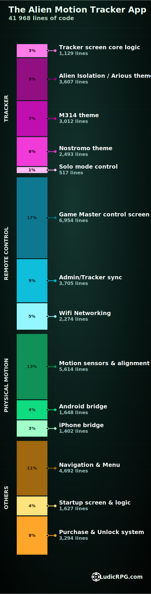
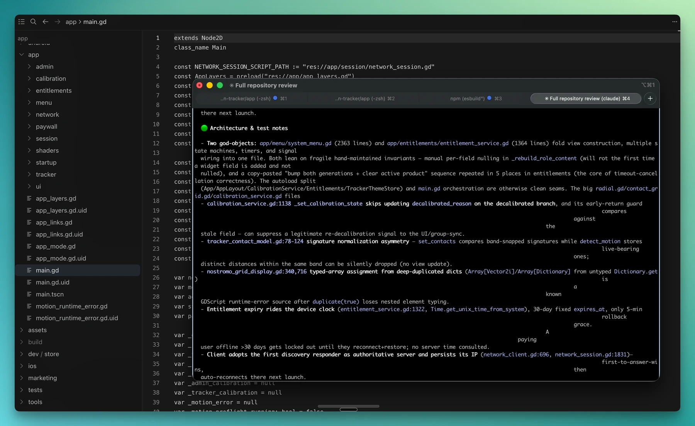
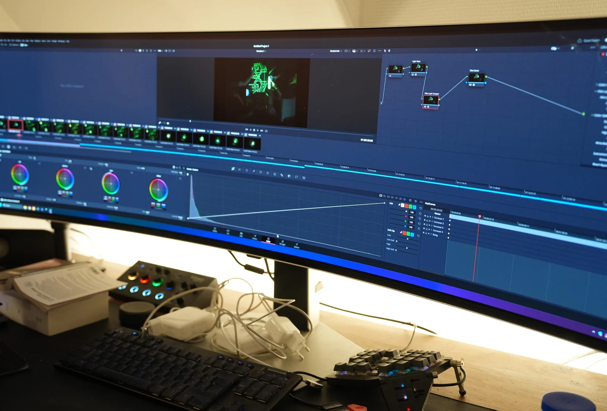
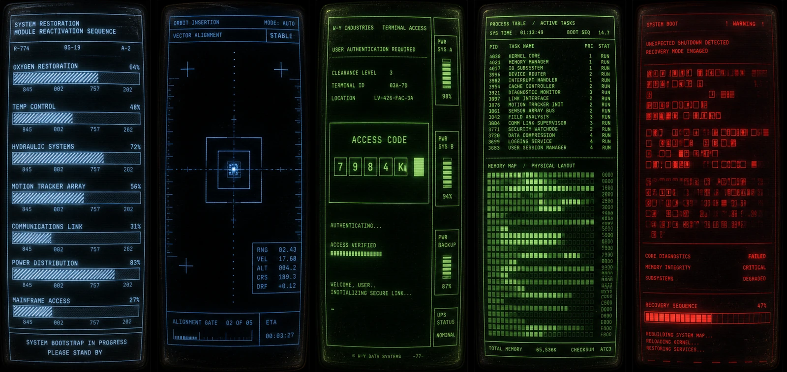

The Alien Motion Tracker app is ready for public release, so I wanted to wrap this devlog with the statistics, tools, and credits behind it.

The first version started on September 3, 2025. Eleven days later, I had a prototype usable in my Alien RPG campaign. At that point, the project had 3,392 lines of code.

Today, it has grown by more than 20 times.

## 72 774 lines of code

With Ludic RPG, my goal is to provide tools and props that enhance the scene and the gameplay while staying almost invisible for the GM.

For the Motion Tracker to feel invisible during play, the work had to move upstream, into design and development. So here is the global split of the codebase: 72 774 lines of hidden work, organized by where the effort actually went.

- **58% of the code is what you have in your hands** as GM or player. Tracker screens, remote control, calibration, menus, themes, native phone bridges...

- **1% of the code is how it reaches your hands.** It is the work needed so you can install it through [Google Play](https://play.google.com/store) and the [Apple App Store](https://www.apple.com/app-store/) like any other app.

- **34% of the code is why it should work reliably in many hands.** The app has to survive real table behavior: a GM locking the phone, a player reconnecting before the GM resumes the app, someone leaving and coming back, calibration being interrupted, a session sleeping for hours. Boring scenarios to write as tests, but they protect the fun part from becoming fragile.

- **7% is the part that stays in my hands.** It is the tooling I use to build, debug, preview, export, and release the app.

The table-facing app is much smaller than the codebase suggests: **28.4 MB to download on iOS** (**73.5 MB installed**) and **31.5 MB to download on Android** (about **80 MB installed**). Themes, sounds, UI, and native phone bridges reach the phone; tests and tooling stay with me.

## Inside the actual app

The runtime application code on your phone is split across different sections.

I kept the chart self-explanatory, but if you have any questions you can ask directly on the [Ludic RPG Discord](https://discord.gg/WYQMvQcYgP). I would be more than happy to chat with you, whether you have a tech background or not.

## Line count does not measure difficulty

The numbers are useful, but they need interpretation.

Motion sensors and calibration represent a lot of code, but the first working version was surprisingly easy to code. The harder part was designing around GM and player behavior: how they align the phones, how much instruction is too much, whether it breaks immersion, and what happens when someone pauses at the wrong time.

The startup screen is a good counterexample. It has roughly the same amount of code as the native iPhone sensor bridge, but the bridge took maybe two hours once I knew what I needed. The startup screen took days, because it was mostly animation, timing, visual taste, and a lot of small creative decisions.

Line count measures the size of the artifact, not the shape of the work. Some code is hard because it is technically delicate. Some code is hard because the feeling has to be right.

## At least sixty full-time days of effort

I did not track the project like a job, because it is a hobby project built at the intersection of my love for TTRPGs, cinema, and the Alien franchise.

My best estimate is around **60 full-time days** of work. If I count a full day as seven hours, that is **roughly 420 hours**.

That includes design, code, video making, article writing, community sharing, answering questions on Reddit or Discord, and all the small invisible jobs around the actual thing. I am probably undercounting, so the real number may be closer to 65 or 70 days.

All of this happened around my full-time job: evenings, nights, weekends, and days off.

## What tools I used

**The app itself** is built with [Godot 4](https://godotengine.org/). I wrote the code in [Cursor](https://cursor.com/), with [Git](https://git-scm.com/) and [GitHub](https://github.com/) handling versioning and backup.

I still use an old [iTerm2](https://iterm2.com/) terminal with [Oh My Zsh](https://ohmyz.sh/) for command-line work. It is an aged little setup, and probably the clearest witness that my software engineering career is now somewhere behind me, waving politely.

The native phone bridges use a little bit of [Gradle](https://gradle.org/), [Java](https://www.oracle.com/java/), [Swift](https://www.swift.org/), and [Objective-C](https://developer.apple.com/library/archive/documentation/Cocoa/Conceptual/ProgrammingWithObjectiveC/Introduction/Introduction.html), so the app can access the fused motion sensor capabilities I needed on real devices.

**For video and visual work**, I used [Adobe Premiere Pro](https://www.adobe.com/products/premiere.html), [After Effects](https://www.adobe.com/products/aftereffects.html), and [Photoshop](https://www.adobe.com/products/photoshop.html). I used them to create the YouTube video, prototype visual effects, and quickly explore visuals before translating them into dynamic drawing and shaders in the app. I recently started using [DaVinci Resolve](https://www.blackmagicdesign.com/products/davinciresolve) too, mostly for video editing.

**For sound design and audio editing**, I used [Audacity](https://www.audacityteam.org/) and [Reaper](https://www.reaper.fm/).

I also re-purchased the 4K movies on [Apple TV](https://tv.apple.com/) so I could study scenes and loop them conveniently beside Premiere Pro. It is one of those invisible expenses that made the design work much more comfortable.

The code was developed on a [MacBook Pro](https://www.apple.com/macbook-pro/) M3 from 2023. Video, graphics, and visual work happened on my desktop workstation / gaming PC. Testing happened on my current iPhone, my old iPhone, and later on an Android phone someone lent me.

## Where AI helped

I used AI extensively while coding, and that is important to say plainly. Few humans can produce 72k relevant lines of code alone in roughly 60 full-time days.

I probably authored less than 25% of the code directly, directed less than 50% of it, and the rest is an AI by-product of iterative work on specs, tests, and corrections.

[Anthropic Claude](https://claude.ai/) was mostly useful for code reviews. I probably ran more than 200 review passes, often across the full codebase. Each full pass could be around one million tokens, so the total is probably around 100 million tokens of AI review. The model was mostly Opus 5. It was especially useful for catching race conditions in networking and scene rendering.

[OpenAI Codex](https://openai.com/codex/) helped me develop features, especially because this was my first project with Godot and my first full mobile app. I had contributed to mobile development years ago, but I had never created and shipped my own mobile app from beginning to end.

Codex was useful for finding the idiomatic way to do things in languages and systems I did not fully know yet. It also became my de facto tool for research and context recovery: reminding me what I had done the previous weekend, gathering CRT terminal references, checking common mobile screen dimensions, and comparing interface constraints.

I also used [ElevenLabs](https://elevenlabs.io/) text-to-speech for the tutorial videos, so I did not have to record and edit all the narration myself. Also, I hate listening to my own voice while editing... so yes, comfort too.

## Sources, references, and borrowed pieces

The M314 base radial grid drawing and base audio originally came from the open-source [AliensMotionTracker project by @martinr1000](https://github.com/martinr1000/AliensMotionTracker/tree/master), written for Raspberry Pi in Python. I distorted and re-pitched the audio to adapt it to the different ranges.

The Arious modified theme base audio came from [@MattFiler on SoundCloud](https://soundcloud.com/mattfiler98). It is probably the game sound file resampled, though I cannot verify that with certainty. I also dynamically re-pitched the ping sound to get the signature distortion you hear when a contact comes closer.

For the interface direction, I kept going back to Alien, Aliens, and [Romulus terminal screens](https://www.reddit.com/r/LV426/comments/1g9m8zw/alien_romulus_screens_ui_and_tech_appreciation/). The trackers themselves are directly connected to the movies, but the menus, calibration screens, and startup screen needed their own logic. I also used a video game terminal reference screen, and of course I cannot remember its name now. *Here is an example of the terminal prototype screens I made to design the startup screen:*

## Closing the journey

It was a big ride. It used almost everything I have learned across design, tech, motion, UI, and UX, and it reminded me why building digital things hooked me when I was 14.

Right now, I am collecting feedback and bug reports during the closed beta. After the mandatory 10-day Google Play delay, I can apply for production access and release the app publicly. Depending on Google's validation process, expect it between July 3 and July 15.

After that, Ludic RPG is not exactly running out of things to do. I need to keep developing [Ludic Field, the map viewer](https://field.ludicrpg.com/), the connected map editor, and more tools for richer in-person TTRPG sessions.

For now, I am focused on co-writing with [Krayorn](https://www.krayorn.com/) a one-shot universe and 20-hour cyberpunk scenario for a double-table session: 2 GMs, 6 players, synced across tables. It already looks promisingly fun.

Finally, so many people shared support and encouraging messages during the journey. That part deserves more than a rushed paragraph at the end of a code-and-tools article, so I will write a dedicated thank-you post before the public release.
