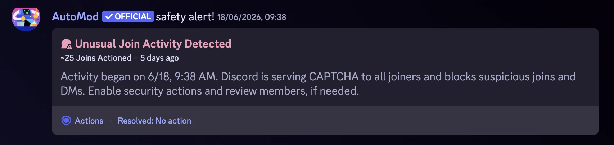
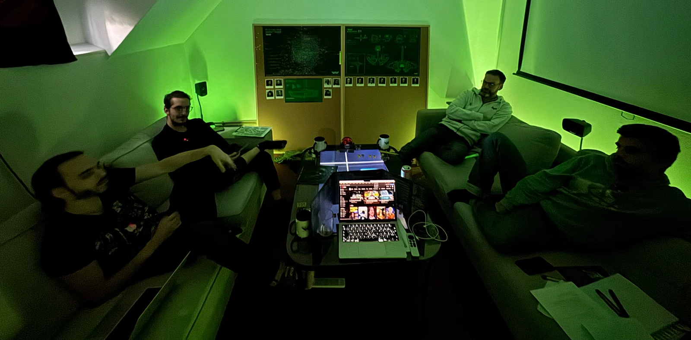
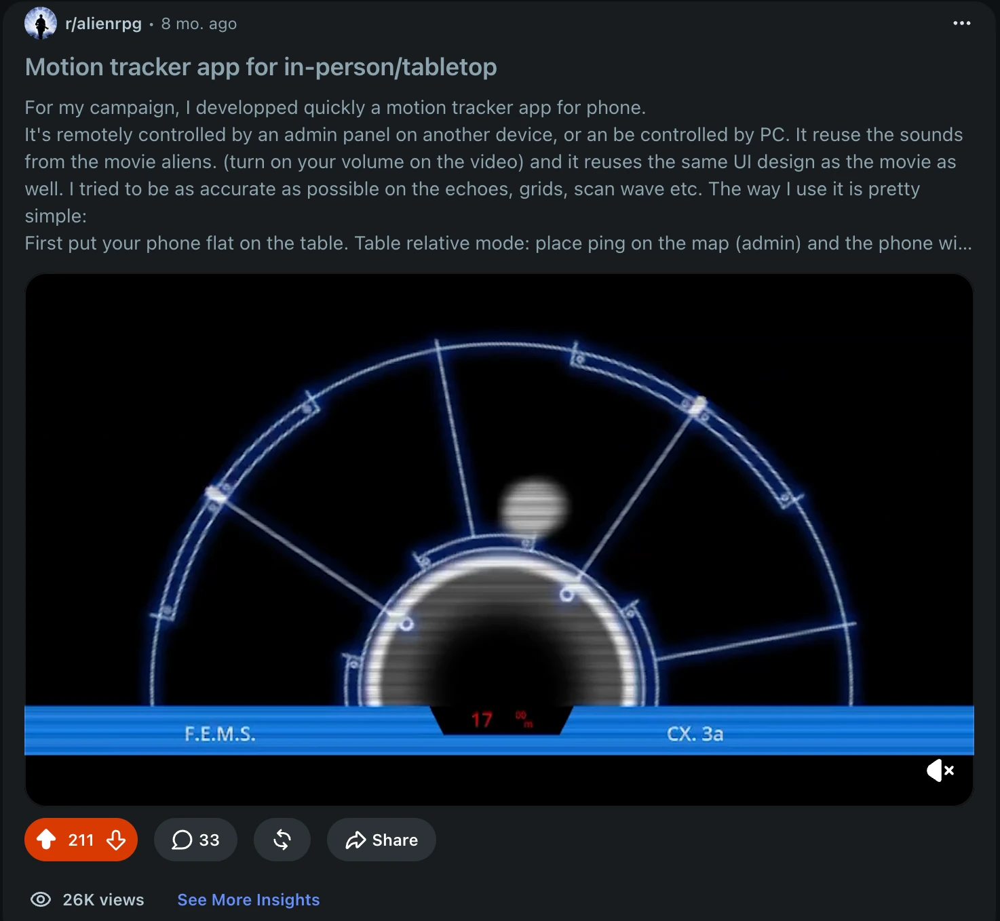
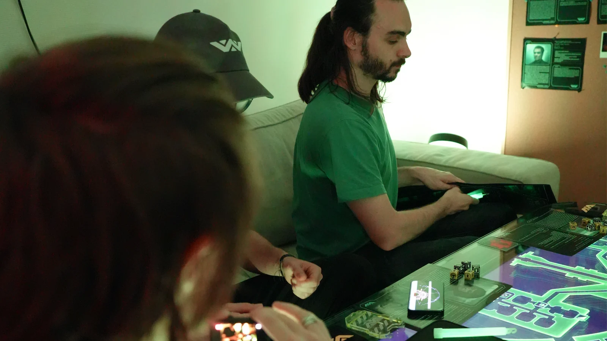

The Alien Motion Tracker app is almost ready to leave closed beta. I needed two or three GMs for the closed beta. Google Play requires 14 testers for 12 continuous days before you can publish an app, but I also needed a reality check: would it actually work at other tables?

An hour after posting on Discord, Reddit, and Facebook, I received a Discord security alert for my tiny Ludic RPG server, where only a handful of people had been around for a year.

I opened the server and watched people joining continuously. Around 120 GMs from all around the world had landed there. Discord thought it was a hostile raid or spam, and I could not believe it.

That was the moment this article became necessary. Before writing the actual release post, I wanted to stop for a retrospective and a proper thank you to the communities and people who helped the app reach release: comments, upvotes, feedback, bug reports, testing, encouragement, and just enough energy to keep me designing and developing until this release became real.

## It started at my own table

Everything started with my [first crash-test Alien campaign](https://ludicrpg.com/blog/behind-the-scenes-of-my-first-alien-rpg-campaign/) with four friends:
- [Krayorn](https://www.krayorn.com/), check his warhammer battle reports
- Cyrik, one day you'll play his med-fan TTRPG
- Damien, and Charly.

They shared focused, positive feedback about the motion tracker, back when it was still something built for our table, and that was the first push. It made the prototype feel worth continuing beyond one campaign.

## Then the internet answered

### The [/r/alienrpg](https://www.reddit.com/r/alienrpg/) subreddit became a pillar of support and encouragement

So many people reacted with enthusiasm and kind words. It was a big surprise.

### The [ALIEN RPG](https://discord.gg/zpM79nMg9X) Discord was phenomenal

*It gathers knowledgeable people around the Alien universe, plus creative people sharing all kinds of content. It became a place to exchange, learn, and feel that the project was being followed by people who understood what the app was trying to do.* I was especially inspired and supported by:

- [Mentorian](https://bit.ly/m/Mentorian), an artist creating so much around the game
- @Rijst, first GM to run a game with the Tracker
- [Iradonian](https://youtube.com/@iradonian?si=MZMZQ90E3o8Ib6oV) perfected the Arious theme (check his actual play on YouTube around Alien RPG)
- [Ninchilla](https://linktr.ee/thenatura1s) basically made tablet support possible through intensive testing. Check his podcast.
- @Guy Yes gave the Nostromo theme its true final look, and drove the app to change its behavior across ranges
- Kirdan found weird edge-cases in user navigation
- @Sugoku, @Bonus Situation, and @Still Collating
- *and other GMs kept showing interest and support.*

### On the French Discord [Alien JDR papier FR](https://discord.gg/Du6BAAYkab), the same thing happened:

- @Nottingham
- @Kosmic Dungeon
- @Aerugis
- @O'Briat made all the text readable in the app
- @Nanoo
- *and a few other GMs shared continuous support throughout the year.*

### Other communities helped the project travel further than my own small circle:

- The [Fantasy Grounds forum](https://www.fantasygrounds.com/forums/forumdisplay.php?124-Alien-RPG) (hi Egheal!) and the [Free League forum](https://forum.frialigan.se/viewforum.php?f=96&sid=dda35c90f0ac3139c6ef1b1c7896c269) (hi Arthur!)
- The [/r/TTRPG](https://www.reddit.com/r/TTRPG/) and [/r/LV426](https://www.reddit.com/r/LV426/) subreddits
- and a few groups like [Alien RPG by Free League](https://www.facebook.com/groups/alienrpg.frialigan), [Alien JDR papier FR](https://www.facebook.com/groups/alienjdr)

All these communities are run by goodwill. Without them, I would never have met so many people, learned so much, or received the encouragement I needed. To all the admins and mods: thank you.

The people named here are the regulars, the most active ones, or the ones who followed the project closely. I probably forgot some, and I am sorry if I did. Anonymous likes, upvotes, and short comments mattered too. They may look small one by one, but accumulated together, they fueled a lot of long hours of work.

## Friends helped turn it into a release

During development, my friends also helped in very concrete ways:

- Cyrik helped me think around the new calibration system, maybe one day you'll play his Medieval fantastic TTRPG
- Koanashi took all the amazing photos
- Vince shot and edited the short teaser video that you will discover at release
- Krayorn and Cyrik jumped in to play the actors in it
- Didine supported all of us during the shoot

And I spammed most of them with my devlogs throughout the year: "please would you be kind enough to read my stuff that you don't really care about and tell me what you think about it." A huge thank you.

## Why the app has a paid part

Before release, there is one practical thing I also want to be clear about: the values behind monetization. I do not want money to get in the way of play. Anyone can install the app for free, use the M314 tracker in solo mode, and join a GM session without paying, forever.

The paid part is for people who want to run games with remote GM control, use all themes, or support my projects. It is a one-time unlock, with several price choices so people can pay what feels fair or affordable. At the fair price, the unlock is $7.99. In many places, that is less than a pizza. Split across a regular four-player table, it is about $2 per player.

I will not add ads or cosmetic microtransactions. Future updates are included in the unlock. Ludic RPG is self-funded, and any money from it goes back into Ludic RPG: tools, props, domains, servers, tests, maps, Field, the editor, or whatever strange thing I decide to build next.

## My open-source promise

Lastly, I can promise you that if for any reason I cannot support and maintain the app anymore, **I would fully open-source it.** It will most probably happen one day anyway.

## What I will remember

The most important part of this post is what I love about TTRPGs: all the people and places where we share things. A good friend told me once, after decades of TTRPG together:

> What I miss most from our golden game years, are not the games, it's the friends.

While making the video, I realized the best part was not the video itself, but doing it with my friends. We were sharing something together. While sharing the devlogs on Discord servers and subreddits, the best part was meeting and engaging with passionate people.

Thank you. I will keep precious memories from sharing this project here, and yes, definitely, I will keep doing it. See you in a few days for the public release.

---

*Thank you to Free League and the authors of Alien RPG, and thank you to MAG for the hype & constant support behind the scenes.* - Ludo
