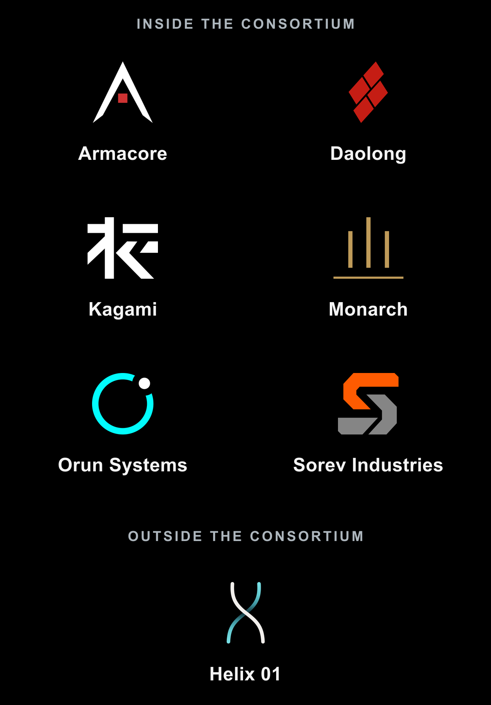

I love the number three.

Three players around a table, one game master. For me, that is the sweet spot for an in-person RPG: everyone stays active and nobody waits twenty minutes to matter. Sessions with my childhood friends had become rare, though, and usually happened over long weekends with too many people for one table.

This time, six players could make it. I wanted us to play an RPG, so [Krayorn](https://www.krayorn.com/) and I started designing one for two tables of three.

Years earlier, I had co-written and run a [*Call of Cthulhu*](https://www.chaosium.com/call-of-cthulhu-rpg/) / [*Delta Green*](https://www.delta-green.com/) game with another GM. It was my first attempt at the format. The stories were connected, but the tables still felt isolated. That became the problem S.I.X. had to solve: players should affect each other in real time and move between tables without ever leaving the same game.

The setting came later. We both love cyberpunk, so we built one around the mechanic. All six characters are trapped inside an underground complex. Three at a time are awake, vulnerable, and hunted, while the other three remotely control war machines on the surface. Krayorn coined the core narrative concept: **escaping from outside**. That paradox gave both tables one shared objective.

The name came only after we knew who could attend. We ended up with six players, plus Krayorn and me as the two game masters. S.I.X. became symbolic, and I started playing with it until the number spread through the setting: Strategic Independence X (S.I.X.), six consortium corporations, six founding principles, and the PROX6 machines.

## Two tables, one game built from scratch

S.I.X. is played at two tables simultaneously, with three players and one game master at each. Both tables follow the same six characters and share the same objective, but each side has its own rules, pace, and problems.

### One table vulnerable, the other powerful

At the first table, three characters are awake inside an underground complex called Hexa, where a hostile AI is hunting them. The remaining three players sit at the second table. Their characters' bodies stay in Hexa while their minds remotely control robotic weapon platforms outside, on the Surface. Those machines are the PROX6, usually called Proxies.

Think [*The Matrix*](https://www.warnerbros.com/movies/matrix), except the characters do not inhabit virtual avatars in a virtual world. They control physical machines moving through the real world above them.

Inside Hexa, the characters are vulnerable. This table favors theater of the mind, roleplaying, corporate plots, NPC interactions, and paper character sheets. It has its own lightweight rules, which I will explain later.

On the Surface, the same characters act through machines powerful enough to confront threats they could never survive in person. This table uses physical maps and a more tactical style of play.

These are not two parallel stories. A discovery, decision, or failure at one table can change the situation at the other before either scene is over. Information, advantages, danger, and even players can cross between the tables while play continues.

### Making both tables share one loop

Krayorn and I kept looking at multiplayer [*Tetris*](https://tetris.com/) and co-op games. In those games, cooperation lives inside the loop itself. Players send each other problems, create openings, and rescue situations while everybody keeps playing. We wanted that feeling across two RPG tables.

The loop we designed ran in both directions. Inside Hexa, players could restore systems, discover routes, and unlock tactical support for the Surface. Some support was as direct as the off-map actions in [*Call of Duty*](https://www.callofduty.com/) or [*Company of Heroes*](https://www.companyofheroes.com/): an air strike, a smoke barrage, or a decoy. Other effects appeared directly on the Surface tablets as bonuses or energy refills.

Surface missions could recover plans, verify clues, disable systems, or force open routes that the group below could not reach. Some problems were deliberately split in half, with each table holding different information or performing a different part of the solution. We were thinking about raids in [*World of Warcraft*](https://worldofwarcraft.blizzard.com/), [*The Division*](https://www.ubisoft.com/en-us/game/the-division/the-division-1), and [*Destiny*](https://www.bungie.net/7/en/Destiny), where coordination matters because nobody can see or do everything alone.

The connection could also turn against them. If someone attacked a pilot's defenseless body inside Hexa, the neural load rose on that player's Proxy. Push it far enough and the connection broke, ejecting the pilot from the machine.

### Players move, problems stay

The split is not fixed at three and three. Both groups can swap tables at a planned moment, but players can also rotate individually. They may choose to send someone across with time-sensitive information. A broken neural connection, called a neural rupture in the rules, can also force one player to move alone. Other events can change the table composition while play continues.

Whenever a new pilot takes over a Proxy, the machine keeps its current position, damage, remaining resources, installed equipment, and unfinished problems. Changing players resets nothing. The new pilot inherits whatever their friend left behind.

### One threat gauge shared by both tables

The hostile AI’s attention is represented by one threat gauge shared by both tables. Players can deliberately draw its attention toward Hexa or the Surface. That may save their friends at one table, but only by making the other table more dangerous. The threat never disappears; it moves.

The threat gauge came from two games I think are superbly designed. In the board game [*War of the Ring*](https://en.wikipedia.org/wiki/War_of_the_Ring_%28board_game%29), the Sauron player divides resources between the Eye's hunt for Frodo and the movement of his armies. In the co-op shooter [*Army of Two*](https://www.ea.com/games/army-of-two), two friends keep each other alive by deliberately trading aggro.

## The world of S.I.X. in 2085

The two-table mechanic gave us the shape of the game. It also made consistency unusually important. Six players would discover one setting through different scenes, different GMs, and sometimes contradictory fragments of information.

### A world stable enough to play with

I am utterly convinced that what separates a good story from a great one is the world supporting it. The story itself can be linear. If the world has depth, you still feel that life continues beyond the protagonists.

For me, it is the [cantina scene in *Star Wars*](https://www.starwars.com/news/9-reasons-why-the-mos-eisley-cantina-is-so-special): strange faces, costumes, habits, objects, and half-heard conversations that do not stop to explain themselves. The plot only passes through that room, but the scene breaks the feeling of a set built solely for the protagonists. There is a larger world behind it.

A GM on the *Alien RPG* Discord, @Still Collating, once described the other half of it this way:

> "Consistency is a virtue. Just cause some of us won't notice, doesn't mean a product that isn't consistent is just as good as one who is. It erodes credibility, if even internal consistency is forgotten like this."

That matters even more in an RPG. Players investigate a world, remember what people said, test its logic, and build plans from what they believe should be true. In S.I.X., a fact learned inside Hexa can become useful on the Surface. If the pieces do not fit, the players cannot reason together.

I do not really think of myself as an author. I feel more like a builder. I like shaping places, corporations, characters, and events, then connecting them until the whole thing holds. S.I.X. was a fifteen-hour campaign, so I was not going to invent a language or write a complete encyclopedia. I needed it to suggest more than we would ever see without having to build all of it.

### Cyberpunk and anticipation

[Philip K. Dick](https://philipdick.com/) is my jam. More broadly, I love what we call *anticipation* in French: near-future fiction that pushes something already present until it becomes uncomfortable.

I did not invent these ingredients. I assembled my version of them. *The Matrix*, [*Deus Ex*](https://www.deusex.com/), [*Shadowrun*](https://www.catalystgamelabs.com/brands/shadowrun), [*RoboCop*](https://www.20thcenturystudios.com/movies/robocop), [*Appleseed*](https://en.wikipedia.org/wiki/Appleseed_%28manga%29), and [*Ghost in the Shell*](https://en.wikipedia.org/wiki/Ghost_in_the_Shell) fed S.I.X.'s bodies, corporations, and the increasingly blurry line between people and machines. [*MechWarrior*](https://en.wikipedia.org/wiki/MechWarrior) and [*BattleTech*](https://store.catalystgamelabs.com/pages/battletech-landing) fed its war machines.

I mixed those influences with our world and pushed everything to 2085. The distance gave me room to invent, although the moment you print a date, reality starts walking toward it.

### Strategic Independence X

The year is 2085. Science and technology have outrun every forecast; inequality has met expectations perfectly and exploded. Humanity maintains fragile colonies on the Moon and Mars, but Earth remains the center of power. Borders are fading, states are weakening, and seven megacorporations dominate the hundreds that remain.

Six of those corporations formed an uneasy consortium around Strategic Independence, a program designed to make traditional governments dependent on corporate infrastructure. Its tenth iteration, Strategic Independence X (S.I.X.), is a shared paramilitary force intended to bring the old world under corporate control.

None of the six will accept a rival's command, so they built an authority that officially belongs to no one: MANDATE, an AI that arbitrates their interests and commands autonomous weapons. Its first operational platforms are the PROX6, robotic war machines originally designed for AI control.

The program's sixth directive, Human Override, requires every PROX6 to provide a human override capable of superseding MANDATE. For human operators, a neural link projects a person's mind into the machine. MANDATE was built beneath Charter City inside Hexa; the PROX6 were built separately on the Surface.

When MANDATE appears to turn against the characters, that separation becomes the game. Their bodies are trapped below, but the PROX6 link lets them inhabit war machines above. The consortium wrote Human Override as a technical requirement. For the players, it is the only way out.

### Seven corporations, seven ideas of power

Helix 01 stands outside the consortium. It remains one of the seven megacorporations, but it was never invited into S.I.X.

I started designing them with one question for each corporation: what does power mean to them?

- **Armacore:** power is force.
- **Daolong:** power is time.
- **Kagami:** power is secrecy.
- **Monarch:** power is prestige.
- **Orun Systems:** power is autonomy.
- **Sorev Industries:** power is production.
- **Helix 01:** power is the unknown.

Those definitions gave each corporation its own incentives. Fragile alliances form where interests overlap, with enough disagreement left inside every alliance to pull it apart. I did not want seven versions of the same supervillain. Their incompatible visions and very ordinary corporate interests create plenty of conflict on their own.

Corporate politics became a secondary objective for the players. They could work out what happened and what each corporation wanted, then decide whether to support one, turn another against its allies, betray a deal, or fool all of them. The lore gave them something to play with instead of a history lesson to sit through.

### Eighteen jobs that belong to 2085

S.I.X. has eighteen playable archetypes: three for each of the six corporations inside the initiative. Sixteen are human, one is an augmented exploration kangaroo, and the eighteenth is a human-scale droid. Every archetype receives the same total number of Attribute and skill points, distributed differently so that the complete roster covers every part of the game. I then translated those numbers into professions rooted in each corporation's worldview.

The first seventeen archetypes each have feminine and masculine portraits, giving the project thirty-four portraits across seventeen pairs. Choosing between them is a small choice on the sheet, but in theater of the mind, a portrait can change how someone imagines and inhabits a character.

 

The professions include “Exoskeleton Extrication Specialist,” “Biotech Organ Repossessor,” and “Critical Asset Recovery Operator.” Finding those jobs took a long time because “security officer,” “medic,” and “tank” belonged to the rules more than the world. I kept asking the same question: in 2085, after society and work have changed, why would this person have exactly these skills?

A crane operator and an exoskeleton specialist may both move heavy things, but one of them anchors the character in the setting. Tiny details like that really matter to me.

The clearest example is the “firefighter.” In this corporate world, that person becomes a **Critical Asset Recovery Operator**. During fires, chemical leaks, collapses, or sabotage, the role may recover machines, servers, prototypes, rare materials, usable evidence, and priority personnel. Accounting, strategic, or legal value comes before the merely human value of a life. The operator can save someone, but the corporation first decides whether that person counts as an asset.

Creating the full cast also helped me write the plot. Designing a profession, its equipment, and the corporation behind it forced me to spend time inside my own setting before I asked the players to live there.

### Giving the cast one visual language

The visual direction mixed cyberpunk, classic TTRPG illustration, and modern poster design. I wanted shape and color to say as much as the drawing itself. Each corporation had its own accent color and its own geometric language, blending the character's environment into the poster around them.

The images are AI-generated. With only ten days to build the campaign, producing all thirty-four portraits at this level without AI was beyond the time and budget I had.

First, I had to translate the characters into details an image model could actually use. A prompt like this meant something to me:

> "Overworked worker, in classic Armacore jumpsuit, walking inside the Hexa complex."

It meant very little to the model. “Armacore” and “Hexa” were local words without reliable visual meaning, so every idea had to become concrete: clothing, material, wear, posture, equipment, machinery, lighting, and environment.

I also tried asking for the finished illustrated style directly. As soon as I pushed for consistency, the characters began to converge into variations of the same cartoon person, sometimes even sharing the same traits. The final chain needed six stages:

- ChatGPT designed the character in words and translated the local concepts into visual details.
- Midjourney produced a photorealistic source image.
- ChatGPT made the first rotoscope-like illustrated pass from that source.
- ChatGPT recolored the image with the corporation's assigned accents.
- ChatGPT added the poster treatment, blending the environment into geometric forms designed for that corporation.
- ChatGPT checked the result against the visual constraints, rejecting images with too much background detail or poorly integrated corporate geometry.

I knew roughly how I would recreate the treatment in Photoshop, but doing so across thirty-four portraits would have taken hours, perhaps days, of manual work. The set still has visible defects and inconsistencies, but for a prototype, I could live with them. Given enough time and money, yes, I would rather commission artists for this work.

### When the model saw “woman”

The feminine variants were often the hardest. For the “firefighter,” the masculine version of the prompt produced these source images:

 

Using exactly the same prompt and changing only its gendered wording, such as “man” to “woman,” produced these proposed feminine versions:

 

Everything else in the prompt was the same. The model removed protective clothing, changed the pose, and turned the worker into a body. Getting back to the same job took around four times as much work.

I repeated that fight across all seventeen feminine portraits. It genuinely angered and saddened me. The tool helped me visualize 2085, but I had to fight a very current bias all the way through it. If “rescue worker” and “woman” already produced this, I did not even want to imagine what “nurse” would produce.

Once the cast finally looked as though it belonged to 2085, it was time to put those characters inside Hexa.

## Inside Hexa: move the dungeon

Hexa is a dungeon the players cannot crawl through. They have to move the dungeon itself. Six vertical Stacks surround the fixed platform on Level 40. Each Stack contains several Decks, but players can enter only the Deck of each Stack currently aligned with Level 40. To change where they can go, they must raise or lower an entire Stack.

Together, the fixed platform and six Stacks form Australis, the part of Hexa where the characters begin.

A Deck is closer to a small district than a room. Decks can be dedicated to housing, recycling, medical care, security, data storage, and many other functions.

Moving a Stack is a commitment. Players can move one or several Stacks in the same locked sequence, but each shifts by only one Deck, up or down. Reaching the new configuration takes roughly one hour of real play, and both tables keep playing while everything moves into place.

The players do not always know what the next Deck contains. Sometimes they find clues. Sometimes they move a Stack blind.

Functional Decks can operate in a degraded or nominal state. Aligning a Generator can restore nominal power at Level 40, changing what the surrounding Decks can do. Some of those effects stay inside Hexa; others reach the Proxies on the Surface. Moving a Stack can therefore open a route for one table while changing the other table's options.

I built a Stack Manager app, projected it on the wall, and gave the players a trackpad. For the whole fifteen-hour weekend, moving the dungeon was their problem. It was a different kind of dungeon crawl, with the map itself in their hands.

Hexa probably came from mixing [*XCOM 2*](https://store.2k.com/game/buy-xcom-2-pc), [*Fallout Shelter*](https://fallout.bethesda.net/en/games/fallout-shelter), and [*Cube*](https://en.wikipedia.org/wiki/Cube_%281997_film%29), a film that got into my head when I was a kid.

### Stress should create play, not penalties

Because this is S.I.X., I used six-sided dice, six Attributes, and eighteen skills, all rated from zero to three. Players combine one Attribute with any relevant skill; every 5 or 6 counts as a success, and every die showing a 6 is rolled again. The rules stay light, while names such as Hardware, Software, and Wetware keep them tied to the setting.

Then I slapped a stress system on top of it, inspired by the [*Rétrofutur*](https://www.legrog.org/jeux/retrofutur) Ubik system. Stress is represented by one physical pool shared by the Hexa table. Failed rolls and worsening situations add points to the container. Players can choose to reroll, but every reroll adds another point.

The GM can spend part of that pool to draw a Complication. Most begin as roleplay prompts rather than numerical penalties, although severe Complications can interfere directly with play. A mild Complication could be:

- **Quality rating:** You constantly rate people, places, or actions as though conducting an audit: “7/10, room for improvement.”
- **Air quotes:** You make air quotes around words that have no reason to be quoted.

A severe Complication could be:

- **Desynchronization:** Every player passes their character sheet to the player on their left until the end of the scene, or until the group regains its composure.

This part also owes something to [*Paranoia*](https://www.mongoosepublishing.com/collections/paranoia). It is deliberately opinionated. I love consequences that are physically felt at the table: fun enough to push the scene somewhere new, but disruptive enough that everyone feels relieved when they disappear. When a bad result creates a new situation rather than a frustrating debuff, that is peak design for me.

Most combat happens on the Surface through the PROX6, so Hexa uses the simplest combat I could get away with: one action each, no initiative, and simultaneous resolution.

## On the Surface: your other body is a war machine

Krayorn designed the Surface and PROX6 game while I designed Hexa. His side deserves a full explanation in his own words, but this is the other half of the game we built.

Surface players choose between light, medium, and heavy chassis, each with attachment slots for modules and weapons. Krayorn designed the battle system and more than sixty modules, then printed four A0 maps and produced the 3D tokens used across them.

My contribution to his side was the visual design of the mechs and their attachment points.

He reused those visuals in the tablet app he built for players to configure their chassis, install equipment, and manage structure, energy, and neural load.

I also produced variants for several enemies, including this boss.

This was the tactical table: powerful machines, physical maps, changing loadouts, and objectives whose consequences could reach the people trapped below. A player arriving on the Surface could inherit a Proxy already damaged, low on energy, badly equipped, and standing in the middle of somebody else's unfinished problem.

Krayorn will probably tell the story from his side and go deeper into the PROX6: their chassis and modules, the maps, and what he learned from running the Surface table. For now, this is enough to see why the Surface was never a separate side adventure. It was the outside half of the same escape.

## Fifteen hours later, did it work?

We ran the full fifteen-hour campaign. The easiest question comes first: did two tables of three have fun? Yes. It was quite a ride.

In ten days, the initial blueprint became five scenarios supported by two linked rulesets, two live apps, seven corporations, eighteen playable archetypes, one dynamic map with more than forty rooms, four A0 tactical maps, three mech chassis, and more than sixty modules. It was absurdly ambitious, and it was playable.

The harder question was the one we had set for ourselves: did we make two tables feel like one game? Honestly, not completely. The introductory scenario exposed the largest gaps. The story did not always distribute its attention evenly between the tables, and actions at one table did not always produce clear enough feedback at the other. Stress, the shared threat level, and the campaign's final outcomes also need refining.

Krayorn and I leaned heavily on our experience as GMs and stayed in constant communication. After the introductory scenario, we were no longer confident the game could remain fun for the full fifteen hours. We corrected what we could during play, readjusted together, and made the second day much more enjoyable.

We found plenty that did not work and collected hours of feedback from all six players. Still, the core is solid as a self-contained campaign. Could it become replayable? Maybe. We discussed something closer to an “extraction TTRPG” than a traditional game, and there are still a lot of possibilities in that direction.

## What S.I.X. changed for me

I had never wanted to create my own game or system. There are already so many excellent TTRPGs, old and new, that I never felt the need. We just wanted to play one with a lot of friends at the same time. Somehow, that became my first experience designing a complete game, from its world and rules to its tools and table experience. I learned an enormous amount, and I am so glad I did it, especially because we shared the whole journey.

Building S.I.X. also improved everything I was already doing around [*Alien RPG*](/#alien-rpg), [*C.O.P.S.*](/#cops-rpg), and other games. Going through the full design process made me better at enhancing existing games from the outside, running sessions, and writing scenarios. Despite the failures, the players' reactions and feedback gave me more motivation to build my own ideas.

Now Krayorn and I have to decide what S.I.X. becomes. We can reinvest in it: iterate, clean it up, and make it something other GMs can run. Or we can archive this version and use what it taught us to build something else.

If you are a GM curious about running S.I.X. or simply seeing the material, join the [Ludic RPG Discord](https://discord.gg/WYQMvQcYgP) and tell us directly. What you tell us could genuinely decide what S.I.X. becomes. **Maybe you can help it escape our table and reach yours.**
