I love the number three.

Three players around a table, one game master. For me, that is the sweet spot for an in-person RPG: everyone stays active and nobody waits twenty minutes to matter. Sessions with my childhood friends had become rare, though, and usually happened over long weekends with too many people for one table.

This time, six players could make it. I wanted us to play an RPG, so [Krayorn](https://www.krayorn.com/) and I started designing one for two tables of three.

Years earlier, I had co-written and run a [*Call of Cthulhu*](https://www.chaosium.com/call-of-cthulhu-rpg/) / [*Delta Green*](https://www.delta-green.com/) game with another GM. It was my first attempt at the format. The stories were connected, but the tables still felt isolated. That became the problem S.I.X. had to solve: players should affect each other in real time and move between tables without ever leaving the same game.

The name came only after we knew who could attend. We ended up with six players, plus Krayorn and me as the two game masters. S.I.X. began as a symbolic name for those six players. At that point, it did not stand for anything inside the fiction. The setting came later.

## We had the loop before we had the world

Because this was built as a special event, we started with the game loop linking the tables. Krayorn and I wanted a real-time connection with immediate shared consequences. Multiplayer [*Tetris*](https://tetris.com/) and cooperative games gave us the model: both tables should create openings, send problems, and rescue one another while play continued. Information, decisions, actions, and solutions had to cross live. A decision at one table might open a route at the other; restoring power could help their friends while making their own situation more dangerous.

We also wanted the groups themselves to mix. Players would physically move between tables during play, sometimes at planned moments and sometimes individually, by choice or because an event forced them across.

With those raw cross-table mechanics in place, we still needed a concept for the game. We explored a lot of ideas before settling on asymmetry: two very different experiences for the players, both inside the same narrative, with each table approaching the shared problem from a different angle.

The concept became this: all six characters would be trapped somewhere. Three at a time would be awake, vulnerable, and in physical danger. The other three would project their minds through a neural connection into physical war machines operating somewhere else.

[*The Matrix*](https://www.warnerbros.com/movies/matrix) was at the center of this concept and has been a huge influence on me. The characters would still project their minds somewhere else, but they would not inhabit virtual avatars in a virtual world. They would control real machines moving through the world above them.

One table would lean into theater of the mind, roleplaying, investigation, and fragile human bodies. The other would use maps and tactical rules, letting those same people act through machines powerful enough to fight back. The contrast was deliberate, but both tables still had to contribute to the same escape.

Krayorn coined the phrase that captured the whole idea: **escaping from outside**. I loved it immediately. It felt original and fun, and I wanted to build the game around it.

We had a loop and a concept. Now we needed a narrative: one strong storyline that could give those mechanics a purpose. We did not even know whether the characters were trapped in a prison, a bunker, or something else.

I always need to answer why for myself. Who had built the machines? Where were they? Why were the bodies and machines separated, and why could these people connect to them? What kind of world would produce this exact situation?

## The world had to answer why

Writing the lore was part of designing the game. Each answer had to support the experience we had already chosen and make its strangest mechanics feel like consequences of the same world.

### Finding the setting in cyberpunk

Krayorn and I both love cyberpunk, so that became the natural place to look. [Philip K. Dick](https://philipdick.com/) is my jam. More broadly, I love what we call *anticipation* in French: near-future fiction that pushes something already present until it becomes uncomfortable.

I went back through the things that had stayed with me. *The Matrix*, [*Deus Ex*](https://www.deusex.com/), [*Shadowrun*](https://www.catalystgamelabs.com/brands/shadowrun), [*RoboCop*](https://www.20thcenturystudios.com/movies/robocop), [*Appleseed*](https://en.wikipedia.org/wiki/Appleseed_%28manga%29), and [*Ghost in the Shell*](https://en.wikipedia.org/wiki/Ghost_in_the_Shell) fed S.I.X.'s bodies, corporations, neural connections, and the increasingly blurry line between people and machines. [*MechWarrior*](https://en.wikipedia.org/wiki/MechWarrior) and [*BattleTech*](https://store.catalystgamelabs.com/pages/battletech-landing) fed its war machines.

I did not invent those ingredients. I assembled my version of them, mixed them with our world, and pushed everything to 2085. The distance gave me room to invent, although the moment you print a date, reality starts walking toward it.

### A world stable enough to play with

I am utterly convinced that what separates a good story from a great one is the world supporting it. The story itself can be linear. If the world has depth, you still feel that life continues beyond the protagonists.

For me, it is the [cantina scene in *Star Wars*](https://www.starwars.com/news/9-reasons-why-the-mos-eisley-cantina-is-so-special): strange faces, costumes, habits, objects, and half-heard conversations that do not stop to explain themselves. The plot only passes through that room, but the scene breaks the feeling of a set built solely for the protagonists. There is a larger world behind it.

Depth comes from details, but the details cannot be arbitrary. They need to feel like the consequences of things already true in the world. One object, profession, or institution should imply a chain of reasons for why it exists.

A GM on the *Alien RPG* Discord, @Still Collating, once described the other half of it this way:

> "Consistency is a virtue. Just cause some of us won't notice, doesn't mean a product that isn't consistent is just as good as one who is. It erodes credibility, if internal consistency is forgotten..."

That mattered even more here. Six players would discover one setting through different scenes, different game masters, and sometimes contradictory fragments of information. They would remember what people said, test the world's logic, and use a fact learned at one table to make decisions at the other. If the pieces did not fit, they could not reason together.

I am not an author. My writing is average at best, sometimes simply bad. I feel much more like a builder. When almost nothing existed, I started shaping places, corporations, characters, and events, then connecting them until the world began to hold. That gave me something solid to write the storyline against.

S.I.X. was a fifteen-hour campaign, so I was not going to invent a language or write a complete encyclopedia. I needed enough depth to support what the players would see while suggesting much more beyond it.

### Strategic Independence X

The year is 2085. Science and technology have outrun every forecast; inequality has met expectations perfectly and exploded. Humanity maintains fragile colonies on the Moon and Mars, but Earth remains the center of power. Borders are fading, states are weakening, and seven megacorporations dominate the hundreds that remain.

Australia had become corporate territory: depopulated by climate disasters and collapsing public infrastructure, but still an open vault of strategic resources. Charter City grew there as a corporate megacity, with the space and secrecy for something much larger underneath it.

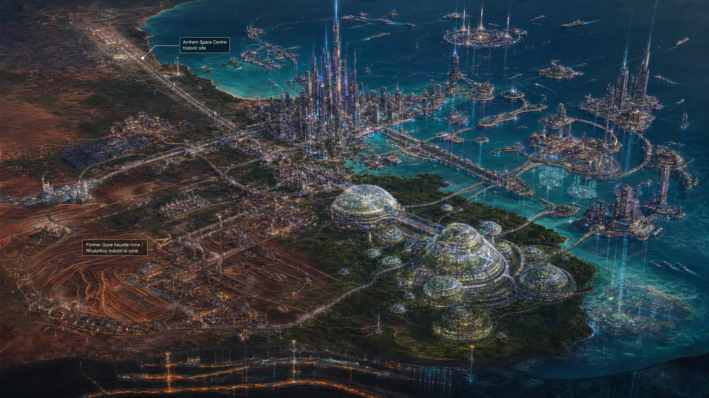

Six of the seven megacorporations formed an uneasy consortium around Strategic Independence, a program designed to make traditional governments dependent on corporate infrastructure. Its tenth iteration gave our symbolic name a meaning inside the world: Strategic Independence X, or S.I.X. It became a shared paramilitary force intended to bring the old world under corporate control.

None of the six corporations would accept a rival's command, so they built an authority that officially belonged to no one. MANDATE would arbitrate their interests and command their autonomous weapons. Its first operational platforms became the PROX6, robotic war machines designed for AI control and usually called Proxies.

Human Override, the program's sixth directive, connected the bodies below to those machines. It required every PROX6 to include a neural link through which a human operator could supersede MANDATE.

MANDATE was built beneath Charter City inside an underground complex called Hexa; the PROX6 were developed separately on the Surface. When MANDATE appeared to turn against the characters, that separation became the escape. Their bodies were trapped inside Hexa, but Human Override let them inhabit the PROX6 and create a route out from the Surface.

The consortium wrote Human Override as a technical requirement. For the players, it became the only way out. I now had reasons for every core mechanic Krayorn and I had settled on.

### Seven corporations, seven ideas of power

At first, the six consortium corporations were still placeholders. I did not need full histories yet. I needed creative starting material: names, logos, colors, and one strong difference I could write against.

A seventh corporation came later, during refinement of the main plot. In the final setting, six corporations belong to the S.I.X. consortium. Helix 01 stands outside it and was never invited.

Black-and-white plots are simply boring to me. They flatten the complexity of people and societies into heroes and villains. At most, they add a few shades of grey and call that nuance.

A passage from [*C.O.P.S.*](/#cops-rpg) struck me when I was a teenager. In the *10-99* supplement, a Californian cop talks with the owner of his regular Chinese restaurant. On paper, it sounds like an absolute cliché, yet the exchange stayed with me. As I remember it, the owner says Western people classify others as either black or white. The cop objects that it is not so simple: people come in different shades of grey. The owner replies that shades of grey are still classifications, and that in reality people can be black and white alternately. Contradiction does not automatically average into grey.

I loved that. Think Thomas Shelby in *Peaky Blinders*, or Tony Soprano in *The Sopranos*. Their humanity complicates their cruelty without absolving it. Hollywood loves the romanticized “good gangster”: the bad man who still has a heart. Reverse the pattern and the reaction changes completely. A man who seems kind but occasionally reveals the bastard underneath is often perceived as a psychopath.

So I left moral judgment to the players and looked for the incentive beneath each corporation. Eventually, it came down to one question: what does power mean to them?

- **Armacore:** power is force.
- **Daolong:** power is time.
- **Kagami:** power is secrecy.
- **Monarch:** power is prestige.
- **Orun Systems:** power is autonomy.
- **Sorev Industries:** power is production.
- **Helix 01:** power is the unknown.

Those answers determined what each corporation wanted, what it would protect, and what it could justify. The players still decided whether any particular act felt good, evil, necessary, or unforgivable. All seven could kill an innocent kitten. They would just do it for different reasons.

Fragile alliances form where interests overlap, with enough disagreement left inside every alliance to pull it apart. Their incompatible visions and very ordinary corporate interests create plenty of conflict on their own.

Corporate politics became a secondary objective for the players. They could work out what happened and what each corporation wanted, then decide whether to support one, turn another against its allies, betray a deal, or fool all of them. The lore gave them something to play with instead of a dull, artificial society populated by interchangeable people in black suits and ties.

### CRED

CRED could mean street cred, credentials, or credits: reputation, access, or money. The system treated all three as a single currency: influence. A reputation might save you once, but then it was spent and had to be rebuilt. This world did not remember favors beyond the transaction.

I used colored poker chips to give that economy a political history. Armacore awarded red CRED; Kagami awarded white. Prices had no color. If something cost six CRED, five white chips and one red paid for it. Mechanically, every color had the same value. Politically, the mix showed which corporations had rewarded the players.

Then every chip spent ended up in the pocket of the corporation receiving the payment. The group could earn most of its CRED from Armacore, then spend most of it with Daolong. The color preserved its origin. The pocket recorded its destination. Over time, those piles could reveal the group's corporate alignment and the resulting shifts in power. As players rotated, their CRED was meant to move with them between the tables, carrying that influence from one side of the game to the other.

Usually, a game's economy expresses its world through a price sheet: what is cheap, what is scarce, and what people value. CRED went deeper, into the definition of the currency itself. Reputation, access, and money were interchangeable because this corporate world reduced all three to influence. The colors and corporate pockets then turned that influence into a visible history of power. Simplifying the economy was almost secondary. What I loved was that, before a single item received a price, the system was already expressing the universe.

## Inside Hexa: move the dungeon

The lore had placed the characters inside an underground complex called Hexa. Now I needed to give that table a game of its own.

Pop culture is full of underground complexes, from the Hive in the [*Resident Evil* film](https://en.wikipedia.org/wiki/Resident_Evil_%28film%29) to the headquarters of half the villains in [James Bond](https://en.wikipedia.org/wiki/James_Bond). Every shape I imagined felt like déjà vu. The Surface table would already be heavy on tactical play, maps, and grids. I did not want to break the asymmetry by giving Hexa a conventional dungeon map as well.

The base-management layer of [*XCOM 2*](https://store.2k.com/game/buy-xcom-2-pc) and the vertical structure of [*Fallout Shelter*](https://fallout.bethesda.net/en/games/fallout-shelter) suggested another direction. I started imagining Hexa as a vertical dungeon rather than a horizontal one. The axis itself was the first twist.

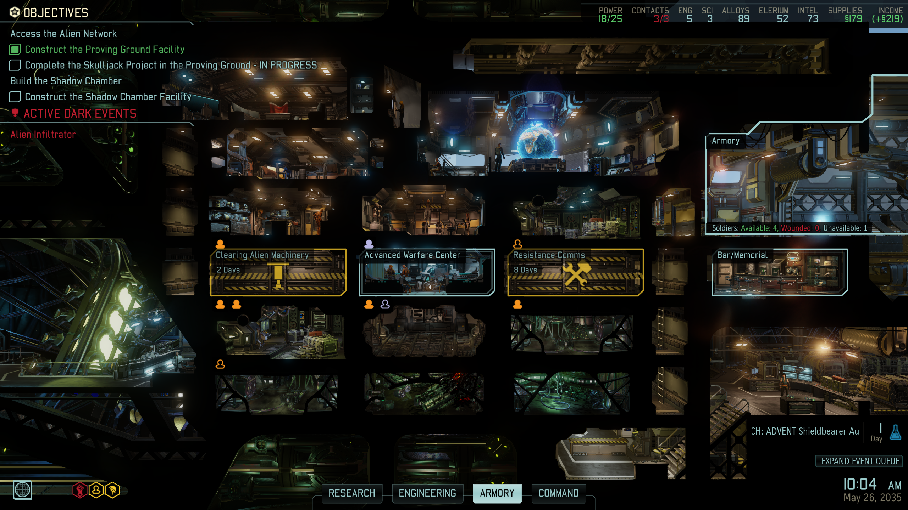 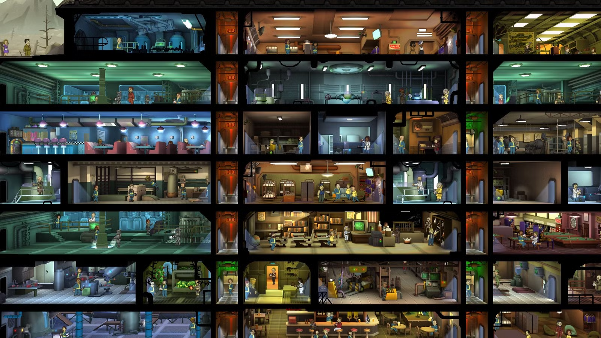

The second twist came from two older memories. As a child, my favorite board game was [*Labyrinth*](https://en.wikipedia.org/wiki/Labyrinth_%28board_game%29). You did not simply follow a path; you shifted the maze to create one. That always felt special to me. [*Cube*](https://en.wikipedia.org/wiki/Cube_%281997_film%29), which struck me as a teenager, probably fed the same idea: the architecture itself could be the threat.

Hexa became a dungeon the players cannot crawl through. They have to move the dungeon itself. I wanted to watch the players discover that twist for themselves. I still had no idea whether it would actually be fun to play.

Picture six vertical towers surrounding a fixed central platform. Each tower works like a giant elevator made from whole districts. The center never moves. In each tower, players can enter only the district currently aligned with the center. To explore a different one, they raise or lower that entire tower until another district reaches it.

Those towers are called Stacks, and their districts are Decks.

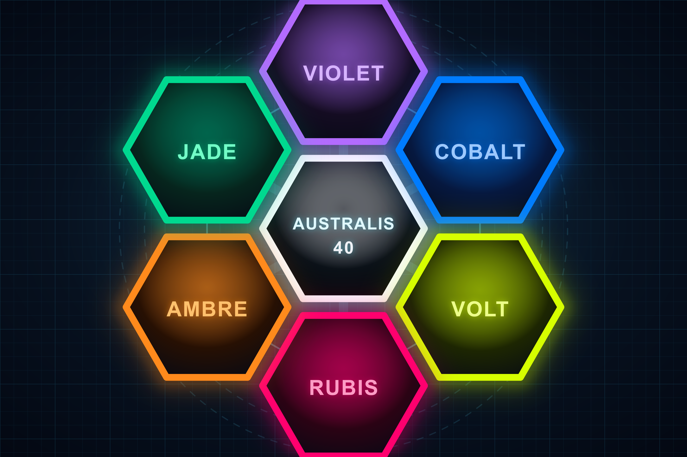 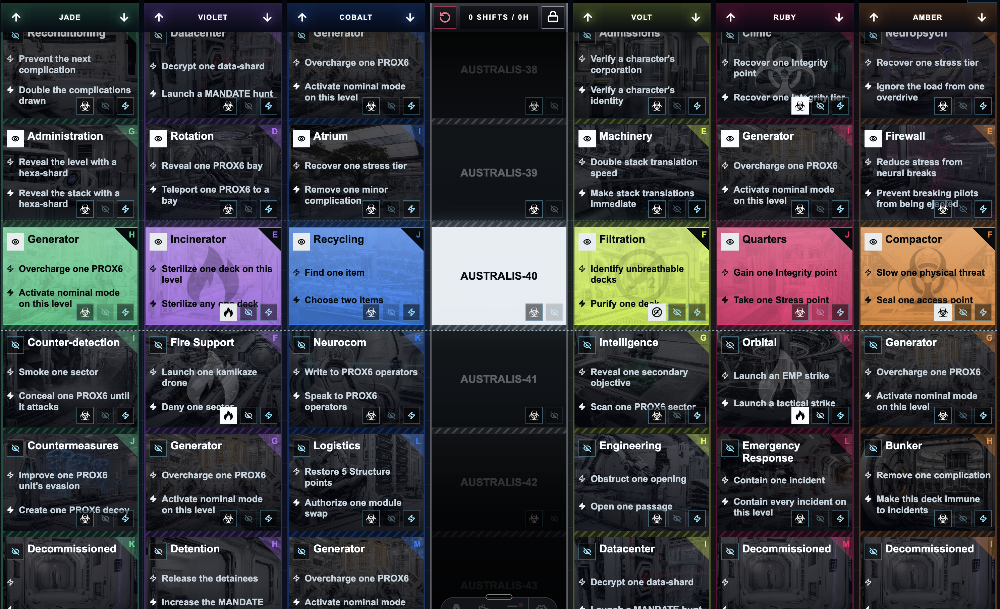

A Deck might contain housing, recycling, medical care, security, data storage, or many other functions.

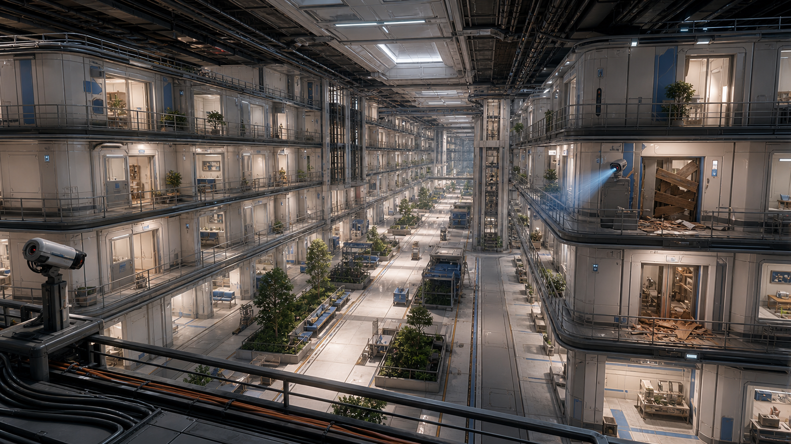
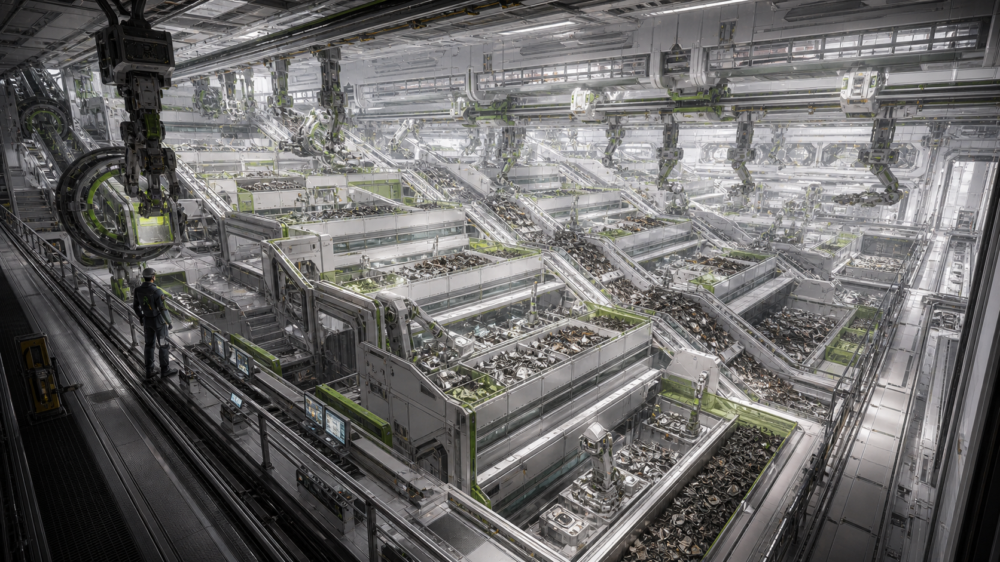

Moving a Stack is a commitment. Players can move one Stack or several at once, but each shifts by only one Deck, up or down. Reaching the new configuration takes roughly one hour of real play, and both tables keep playing while everything moves into place.

The players do not always know what the next Deck contains. Sometimes they find clues. Sometimes they move a Stack blind.

Aligning a Generator Deck with the center can restore power and change what the surrounding Decks can do. Moving a Stack could open a route below while changing the Surface table's options.

I built a Stack Manager app, projected it on the wall, and gave the players a trackpad. For the whole fifteen-hour weekend, moving the dungeon was their problem. It was a different kind of dungeon crawl, with the map itself in their hands.

## On the Surface: mech tactics enhanced with tech props

Krayorn designed the Surface and PROX6 game while I designed Hexa. His table played very differently from mine. He will probably write about this journey from his side and go deeper into the chassis, modules, maps, and what he learned from running it.

Surface players choose between light, medium, and heavy chassis, each with attachment slots for modules and weapons. Krayorn designed the battle system and more than sixty modules, then printed five A0 maps and produced the 3D tokens used across them.

Every player piloting a PROX6 had a tablet running a custom app Krayorn built. They used it to assemble and configure their machine, install modules and weapons, and monitor its structure, energy, and neural load throughout play.

My contribution to his side was the visual design of the mechs and their attachment points.

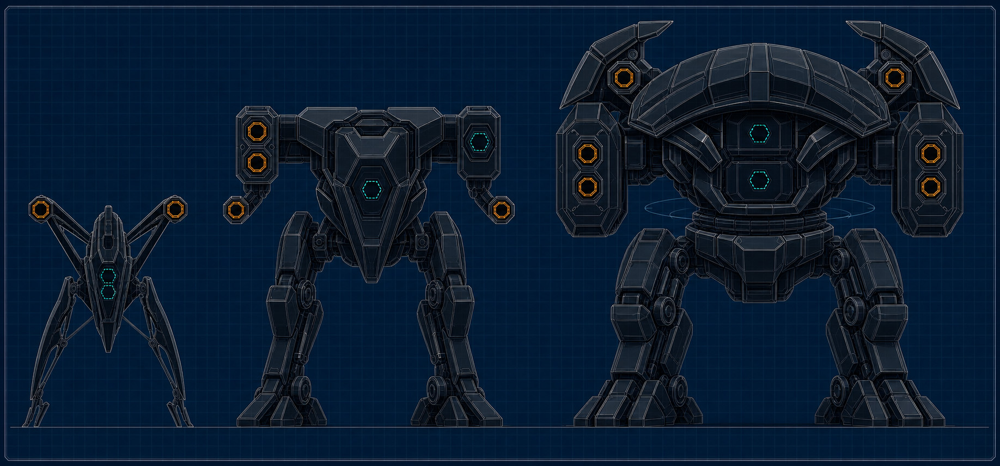

I also produced variants for several enemies, including this boss, so the same blueprint language could describe both sides of a fight.

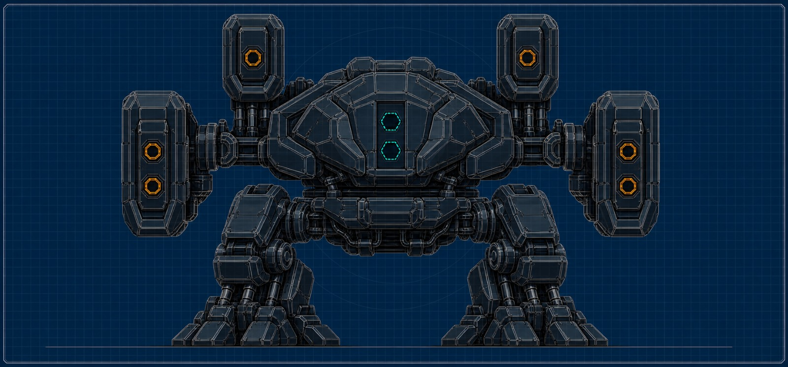

The same visual system carried into the player app.

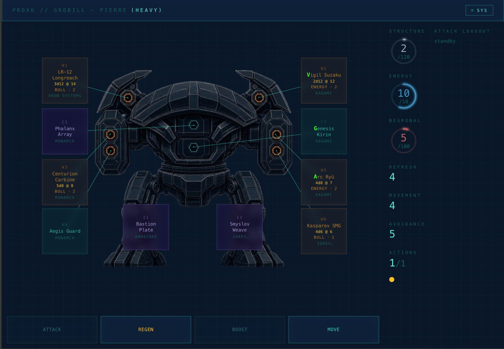

Traditional mech games can demand a lot of bookkeeping. We wanted the tactical depth without asking each player to become the accountant of their own war machine. The tablets absorbed the calculations and resource tracking without isolating everyone behind a private screen. The maps, decisions, and conversation still belonged to the whole table.

That is how we envision technology to work at a Ludic RPG table: remove friction, expose what matters, and then get out of the way.

Each GM also had a tablet or laptop to synchronize effects between the tables. Through those devices, bonuses, special capabilities, debuffs, and shifts in MANDATE's attention could reach the other GM while both scenes kept moving.

The neural connection meant danger could cross too. If someone attacked a pilot's defenseless body inside Hexa, their Proxy's neural load rose until a neural rupture broke the link and ejected them from the machine.

When another pilot took over, the Proxy did not reset. It kept its position, damage, remaining resources, equipment, and unfinished problems exactly as the previous player had left them. The new pilot inherited all of it.

This was the tactical table: powerful machines, physical maps, and changing loadouts.
The Surface was never a separate side adventure. It was the outside half focused on achieving the escape.

## Escape could not wait

Once Hexa and the Surface each had a game of their own, players still needed a reason not to solve everything at their leisure. Their objective was simple: survive and escape. We used two forms of pressure to keep that objective present in every scene: Stress accumulated locally inside Hexa, while MANDATE's attention moved across both tables.

### Stress should create play, not penalties

Because this is S.I.X., I used six-sided dice, six Attributes, and eighteen skills, all rated from zero to three. Players combine one Attribute with any relevant skill; every 5 or 6 counts as a success, and every die showing a 6 is rolled again. The rules stay light, while names such as Hardware, Software, and Wetware keep them tied to the setting.

Then I slapped a stress system on top of it, inspired by the [*Rétrofutur*](https://www.legrog.org/jeux/retrofutur) Ubik system. Stress is represented by one physical pool shared by the Hexa table. Failed rolls and worsening situations add points to the container. Players can choose to reroll, but every reroll adds another point.

The GM can spend part of that pool to draw a Complication. Most begin as roleplay prompts rather than numerical penalties, although severe Complications can interfere directly with play. A mild Complication could be:

- **Quality rating:** You constantly rate people, places, or actions as though conducting an audit: “7/10, room for improvement.”
- **Air quotes:** You make air quotes around words that have no reason to be quoted.

A severe Complication could be:

- **Desynchronization:** Every player passes their character sheet to the player on their left until the end of the scene, or until the group regains its composure.

This part also owes something to [*Paranoia*](https://www.mongoosepublishing.com/collections/paranoia). It is deliberately opinionated. I love consequences that are physically felt at the table: fun enough to push the scene somewhere new, but disruptive enough that everyone feels relieved when they disappear. When a bad result creates a new situation rather than a frustrating debuff, that is peak design for me.

### The threat never disappears; it moves

MANDATE's attention is represented by one threat gauge shared by both tables. Players can deliberately draw its attention toward Hexa or the Surface. That may save their friends at one table, but only by making the other table more dangerous. The threat never disappears; it moves.

I borrowed the idea from two games I think are superbly designed. In [*War of the Ring*](https://en.wikipedia.org/wiki/War_of_the_Ring_%28board_game%29), Sauron divides resources between the hunt for Frodo and the movement of his armies. In [*Army of Two*](https://www.ea.com/games/army-of-two), two friends keep each other alive by deliberately trading aggro.

## Designing a raid across both tables

Some scenarios were designed to feel closer to a live multiplayer raid than to two RPG scenes running in parallel. We looked at the raid mechanics of [*Destiny*](https://www.bungie.net/7/en/Destiny), [*World of Warcraft*](https://worldofwarcraft.blizzard.com/), and [*The Division*](https://www.ubisoft.com/en-us/game/the-division/the-division-1): neither group could see or solve the whole problem, and progress at one table changed the situation at the other while both kept playing.

One scenario began inside Hexa, where NPCs caught in the conflict between Monarch and Daolong tried to pull the group in different directions. Siding with one corporation, refusing both, or ignoring the conflict changed the information the players received. That information revealed corpo plot but also opened a new route on the Surface for the PROX6 pilots.

Restoring a Generator Deck created a longer loop. Powering it allowed other Decks to provide Surface support, such as an orbital strike or an emergency energy refill. It also increased MANDATE's ability to react inside Hexa. The AI could close doors to isolate players, start fires, or activate autonomous systems against them. The Surface group then had to reach a specific console or deliberately draw MANDATE's attention elsewhere, lowering the threat inside the complex for their friends.

Another chain began with a file found below. It explained more of what had happened inside Hexa, but also contained an activation code that could be used only from the Surface by a PROX6. Entering it offered the Hexa players a choice of rewards while broadcasting a tracking signal to the corporations hunting the Surface group.

## 18 Playable characters: where the world meets the player

Characters are where all that worldbuilding finally reaches a player. The setting becomes someone they can inhabit, and the player becomes someone who belongs inside it.

S.I.X. has eighteen playable archetypes: three for each of the six corporations inside the initiative. Sixteen are human, one is an augmented exploration kangaroo, and the eighteenth is a human-scale droid. Every archetype receives the same total number of Attribute and skill points, distributed differently so the full group can cover every part of the game.

The numbers gave me functions. I still had to find the people this world would produce. “Security officer,” “medic,” or “tank” described what a ruleset needed. They said very little about who someone was in 2085, what they did every day, or why a corporation kept them around.

The corporations had been top-down worldbuilding: large ideas of force, time, secrecy, prestige, autonomy, and production. Characters let me build from the bottom up, starting with a job, a tool, a body, a belief, or an ordinary day. Each answer added another piece to the world around them.

An **Industrial Food Line Manager**, for example, supervises a robotic mass-catering line capable of feeding hundreds of workers per shift. They manage stocks, crews, machinery, rations, and nutritional supplements. Sorev's mandate for them is brutally clear: keep bodies operational, crews compliant, and production profitable at the lowest possible biological cost. One character turned the corporation's abstract idea of production into a workplace, a daily routine, and a moral problem a player could inhabit.

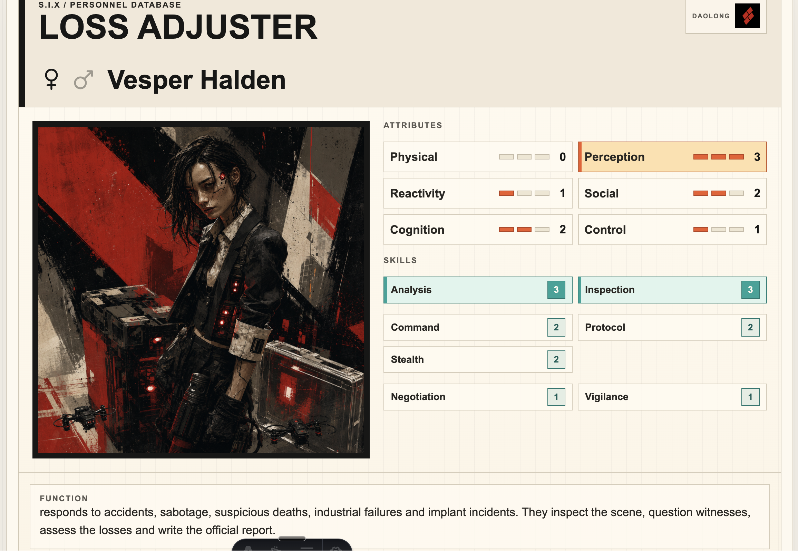 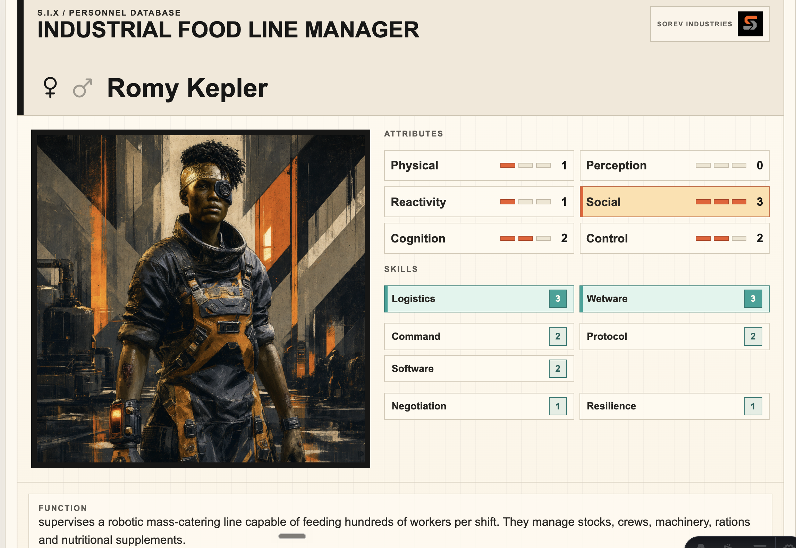

An **Exoskeleton Extrication Specialist** separates a trapped operator from a machine that is still under load, knowing the corporation considers both the body and the chassis assets. A **Machine Cult Preacher** is officially an autonomous-systems technician and unofficially a religious leader whose rituals are tolerated because the machines keep working.

Writing them gave me scenes and conflicts I would never have found in a timeline alone.

### Giving S.I.X. a face

For me, character portraits are the ultimate expression of a game's identity. I am always a little sad when a TTRPG overlooks them.

When I was younger, the first thing I did with a new RPG book was jump straight to the full-color illustrations in the middle. You could spot that section from the edge of the book: a narrow stripe of color among all the black-and-white pages that were cheaper to print. It often included illustrations of the game's character archetypes.

At this stage, the portraits became a visible record of what the game had become. A character is where the world stops being abstract: its jobs, technology, institutions, clothes, tools, and daily pressures all have to fit inside one person. Anything I had left vague became visible too.

That person does not need to be original. In a police RPG, playing the absolute cliché of a cop may be exactly the point. What matters is whether the details reveal which world produced that cop.

The visual direction mixed cyberpunk, classic TTRPG illustration, and modern poster design. Each corporation received its own accent color and geometric language, with parts of the character's environment breaking into the poster around them.

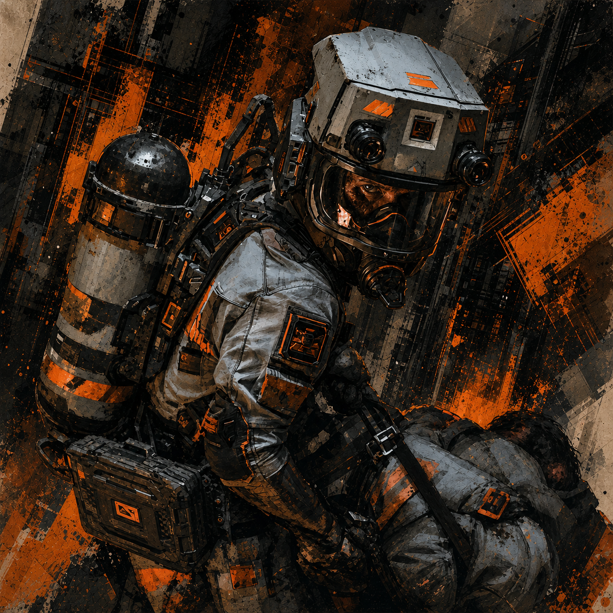
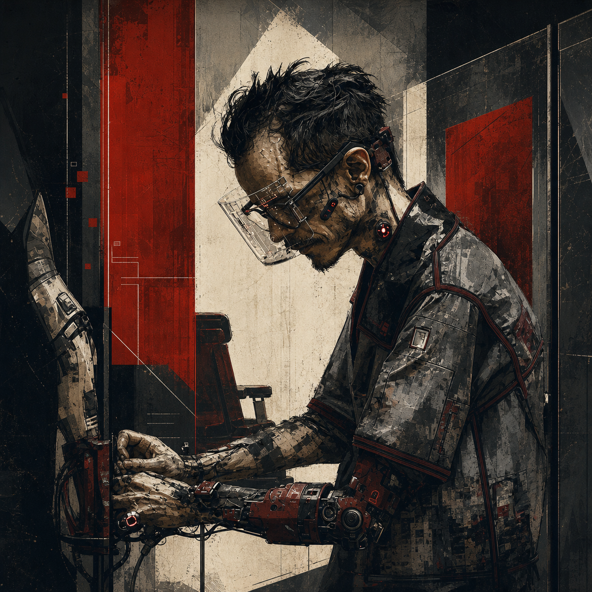
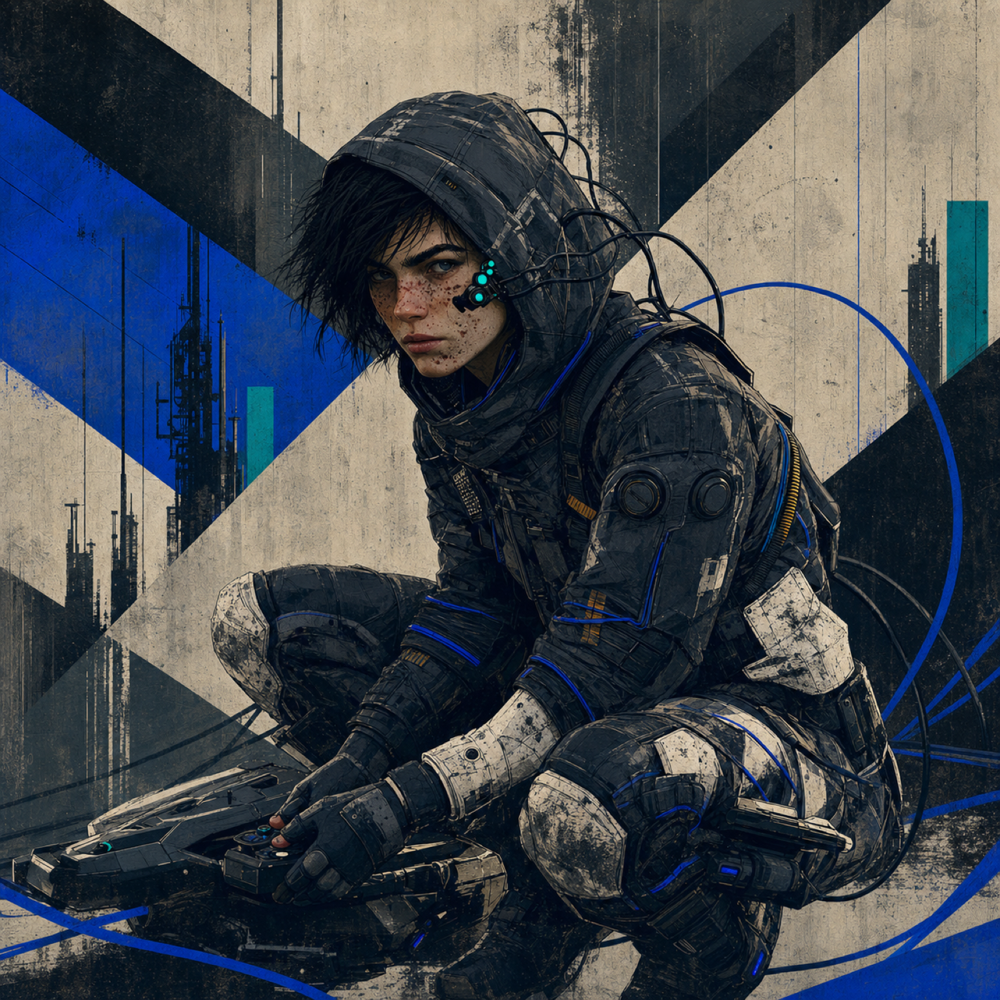
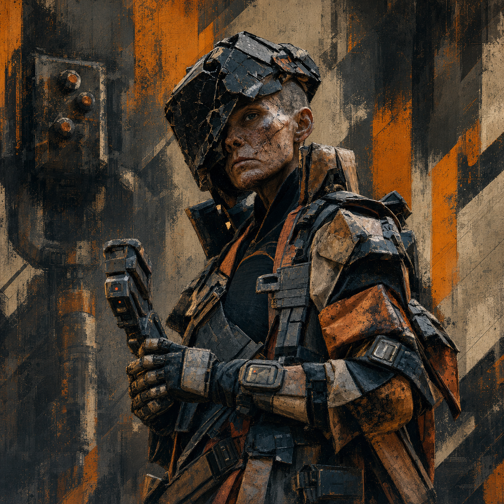
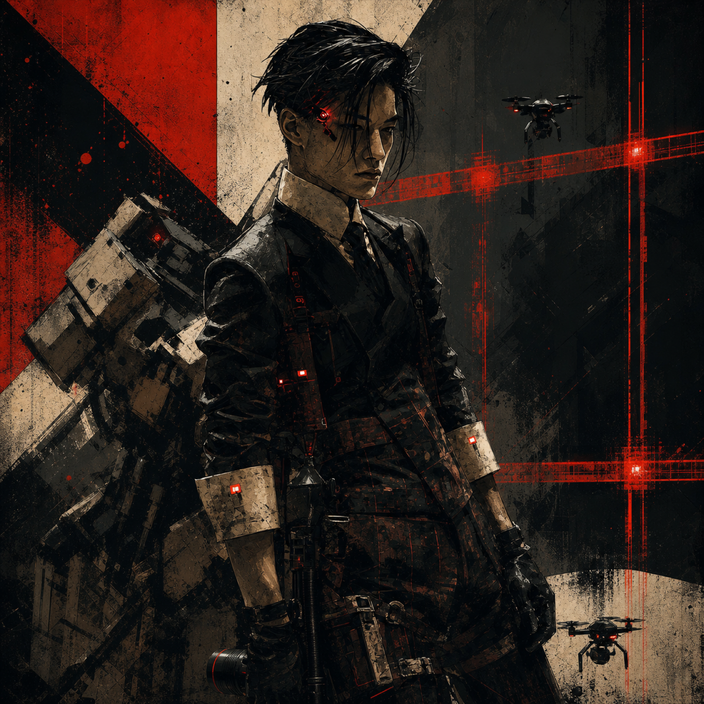
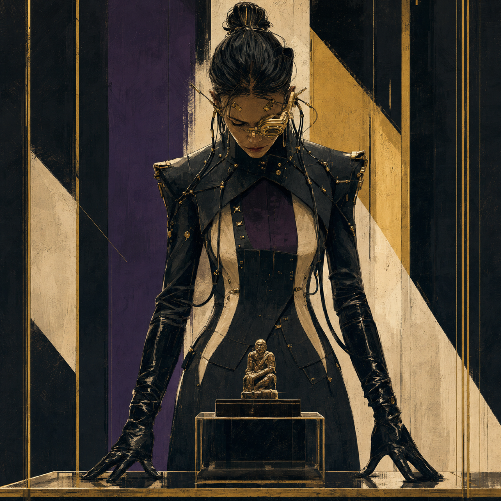

The full set needed a shared visual identity without flattening its characters into variations of the same person. AI was useful precisely because this was a ten-day prototype: it let me attempt thirty-six portraits that would have taken me months to create manually in Photoshop.

Working this way still forced me to think through every image: what an Armacore jumpsuit was made of, where it had worn out, what the worker carried, what machinery surrounded them, and how Hexa was lit. Resolving the image also resolved more of the world, and those answers fed back into my writing.

Generating the finished illustration in one step was a complete failure. The harder I pushed for consistency, the more the cast collapsed into dull variations of the same empty cartoon person. So I split the work across different AI tools. One produced diverse photorealistic sources; another built the final look over several passes, adding the illustration style, poster treatment, corporate accents, and geometry.

The result is nowhere close to what I would want from a finished version, but for a quick prototype, it's perfect.

Style consistency was only one problem.

### When the model saw “woman”

Each of the eighteen playable characters had a masculine and a feminine variant, bringing the set to thirty-six portraits. The feminine portraits were the hardest to produce and probably tripled the total production time. For the “firefighter,” the masculine version of the prompt produced these source images:

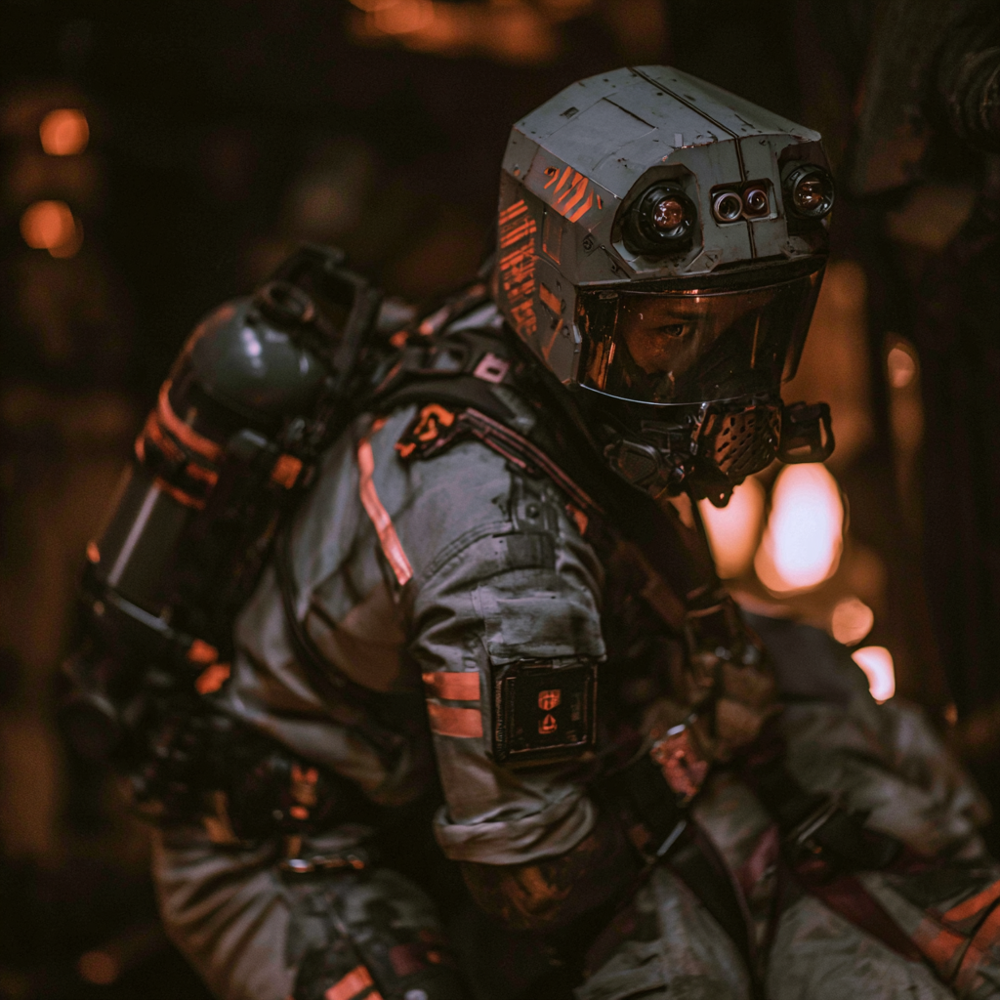 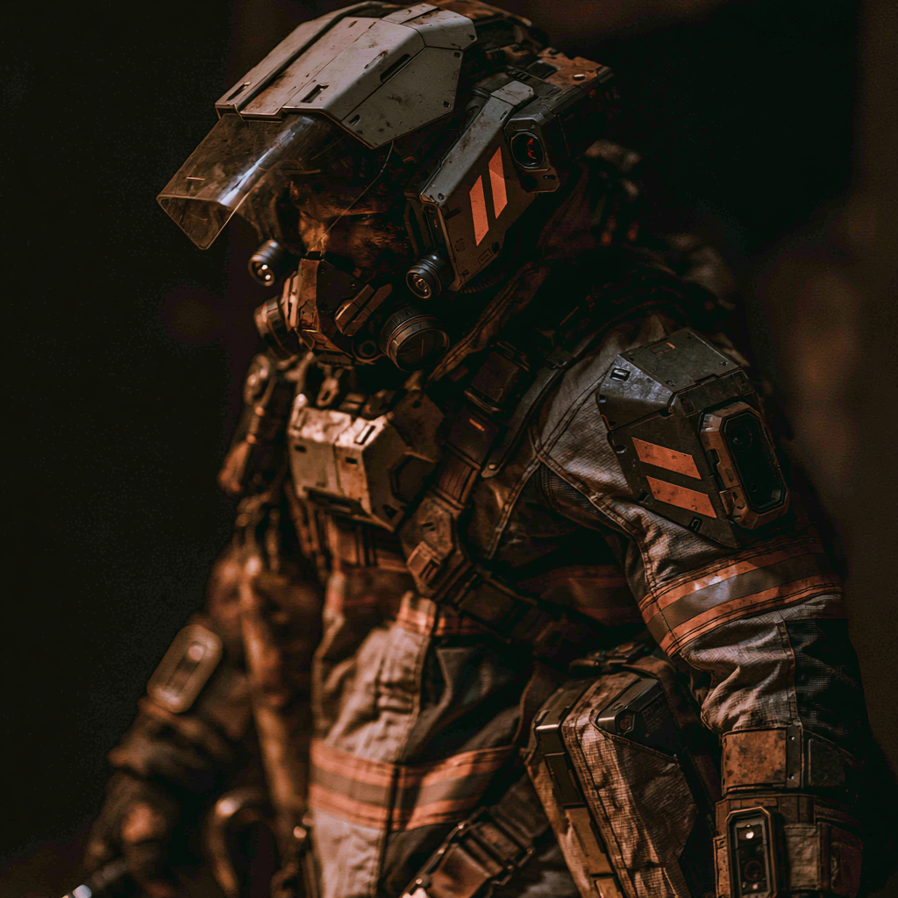

Using exactly the same prompt and changing only its gendered wording, such as “man” to “woman,” produced these proposed feminine versions:

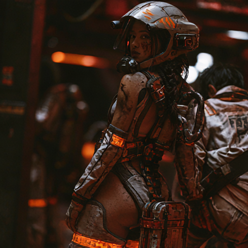 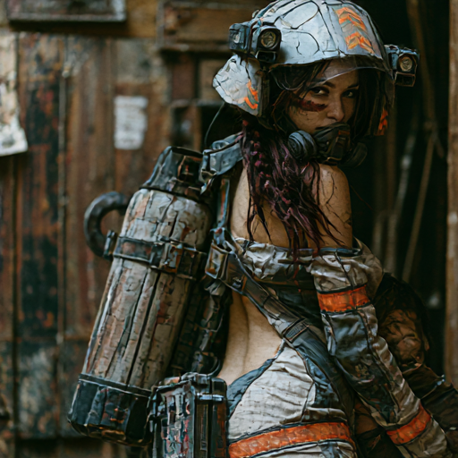

Everything else in the prompt was the same. The model removed protective clothing, changed the pose, and turned the worker into a body. Getting back to the same job took around four times as much work.

I repeated that fight across all eighteen feminine portraits. It genuinely angered and saddened me. The tool helped me visualize 2085, but I had to fight a very current bias all the way through it. If “rescue worker” and “woman” already produced this, I did not even want to imagine what “nurse” would produce.

Then the ten days were over, our friends arrived, and all of this had to work at the table.

## Fifteen hours later, did it work?

We ran the full fifteen-hour campaign. The easiest question comes first: did two tables of three have fun? Yes. It was quite a ride.

In ten days, the initial blueprint became six scenarios supported by two linked rulesets, two live apps, seven corporations, eighteen playable archetypes, one dynamic map with more than forty rooms, five A0 tactical maps, three mech chassis, and more than sixty modules. It was absurdly ambitious, and it was playable.

The harder question was the one we had set for ourselves: did we make two tables feel like one game? Honestly, not completely.

The introductory scenario exposed the largest gaps. Players received too much information before they had a clear enough goal or incentive to act on it. That was mostly a scenario problem: we had built a large world and several systems, but the opening did not turn any of it into a clear reason to act.

Some players naturally preferred one table, which was expected in an asymmetric game. Yet the story itself also distributed its attention unevenly. The asymmetry worked mechanically, but not yet narratively. Actions at one table did not always produce clear enough feedback at the other.

CRED was supposed to create another connection by moving between the tables. During the playtest, we could not make that circulation work.

The pressure around the main objective was also too fragile. Stress, the shared threat level, and the campaign's final outcomes were supposed to keep “survive and escape” present, but they did not create enough urgency. It was both a game design problem and a GMing problem. Krayorn and I had built so much that we were sometimes overwhelmed trying to keep all of it moving. We missed this badly.

After the introductory scenario, we were no longer confident the game could remain fun for the full fifteen hours. We stayed in constant communication and readjusted the remaining scenarios together as we ran them. Most of that meant rebalancing the plot on the fly, moving more information toward the Surface table, and giving the players clearer reasons to act and more immediate goals. That made the second day much more enjoyable, and the campaign probably reached its most satisfying stretch around the midpoint. It was reassuring, but it also showed how much of the experience still depended on the two GMs holding it together in real time.

We found plenty that did not work and collected hours of feedback from all six players. Even so, I believe we built a solid prototype. It was too ambitious, for sure, but the players had fun, and none of us had played anything quite like it before.

The next question is whether S.I.X. could become replayable. Maybe. We discussed something closer to an “extraction TTRPG” than a traditional game, and there are still a lot of possibilities in that direction.

## What S.I.X. changed for me

I had never wanted to create my own game or system. There are already so many excellent TTRPGs, old and new, that I never felt the need. We just wanted to play one with a lot of friends at the same time. Somehow, that became my first experience designing a complete game, from its world and rules to its tools and table experience. Building it from scratch with Krayorn taught me an enormous amount, and I am so glad we shared the whole journey with our friends.

That experience will feed directly into almost everything I do through Ludic RPG: writing scenarios and campaigns, running sessions, and creating tools and props for existing games such as [*Alien RPG*](/#alien-rpg) and [*C.O.P.S.*](/#cops-rpg).

Even the failures give me confidence. We have not fixed those problems yet, but when the players exposed one, Krayorn and I could quickly see ways to improve it. We are not stuck inside our own design; their feedback gives us clear directions for the next iteration. Seeing that path forward makes our progress visible. It is game design in practice.

Now Krayorn and I have to decide what S.I.X. becomes. We can reinvest in it: iterate, clean it up, and make it something other GMs can run. Or we can archive this version and use what it taught us to build something else.

If you are a GM curious about running S.I.X. or simply seeing the material, join the [Ludic RPG Discord](https://discord.gg/WYQMvQcYgP) and tell us directly. What you tell us could genuinely decide what S.I.X. becomes. **Maybe you can help it escape our table and reach yours.**
