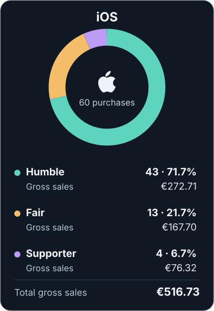
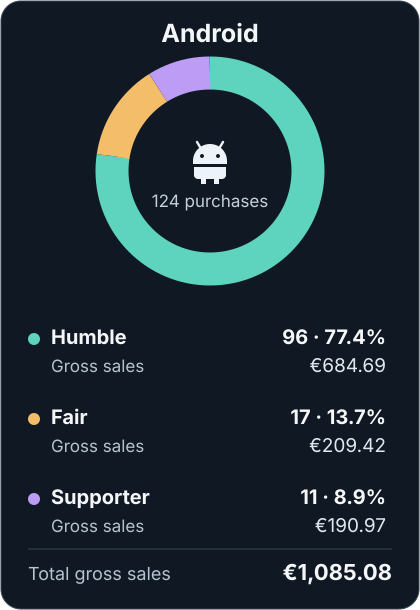

It's been a month since I released the [Alien Motion Tracker app](/alien-motion-tracker/) for iPhone and Android. Checking the analytics, I'm surprised by how much support the Alien fanbase has given me. As promised in my [code of conduct](/code-of-conduct/), I'm sharing the numbers and how much the app has earned.

## All-time downloads and sales

The table shows **total gross sales before app-store commissions**, using the stores' reported customer prices.

<section class="article-report alien-report-overview" aria-label="All-time sales and first-time downloads">

Display currency

<button type="button" data-report-currency="EUR" aria-pressed="true">EUR €</button>
<button type="button" data-report-currency="USD" aria-pressed="false">USD $</button>

<table class="report-totals" aria-label="All-time totals, including Android beta">
<thead><tr><th scope="col">Platform</th><th scope="col">First-time downloads</th><th scope="col">Total purchases</th><th scope="col">Total gross sales</th></tr></thead>
<tbody>
<tr><th scope="row">iOS</th><td>446</td><td>60</td><td>€516.73</td></tr>
<tr><th scope="row">Android</th><td>1,309</td><td>124</td><td>€1,085.08</td></tr>
<tr class="report-total"><th scope="row">TOTAL</th><td>1,755</td><td>184</td><td>€1,601.81</td></tr>
</tbody>
</table>

</section>

This includes Android beta downloads and **40 beta purchases totaling €369.48 in gross sales**.

## Price tier breakdown

I made three price tiers, all of which unlock the same full app. Paying more is simply a way to support Ludic RPG. Among the **184 purchases**, roughly one in four was at one of the higher prices, which is a nice touch from the community.

- Humble: 75.5% · 139 purchases · €957.40 gross sales
- Fair: 16.3% · 30 purchases · €377.12 gross sales
- Supporter: 8.2% · 15 purchases · €267.29 gross sales

## Where the tracker went

The stores report downloads across **77 countries and territories**, with sales in 22.

<section class="article-report country-sales" aria-labelledby="country-sales-heading">
<h3 id="country-sales-heading">Gross sales by country</h3>
<table aria-labelledby="country-sales-heading">
<colgroup><col class="rank-column"><col><col class="amount-column"></colgroup>
<thead><tr><th scope="col">Rank</th><th scope="col">Country</th><th scope="col" class="amount">Gross sales</th></tr></thead>
<tbody>
<tr><td class="rank">1</td><th scope="row">🇺🇸United States</th><td class="amount">€714.10</td></tr>
<tr><td class="rank">2</td><th scope="row">🇬🇧United Kingdom</th><td class="amount">€232.40</td></tr>
<tr><td class="rank">3</td><th scope="row">🇫🇷France</th><td class="amount">€194.34</td></tr>
<tr><td class="rank">4</td><th scope="row">🇩🇪Germany</th><td class="amount">€94.53</td></tr>
<tr><td class="rank">5</td><th scope="row">🇨🇦Canada</th><td class="amount">€42.81</td></tr>
<tr><td class="rank">6</td><th scope="row">🇮🇹Italy</th><td class="amount">€38.96</td></tr>
<tr><td class="rank">7</td><th scope="row">🇩🇰Denmark</th><td class="amount">€37.24</td></tr>
<tr><td class="rank">8</td><th scope="row">🇦🇺Australia</th><td class="amount">€36.82</td></tr>
<tr><td class="rank">9</td><th scope="row">🇳🇱Netherlands</th><td class="amount">€31.81</td></tr>
<tr><td class="rank">10</td><th scope="row">🇵🇱Poland</th><td class="amount">€27.69</td></tr>
<tr><td class="rank">11</td><th scope="row">🇧🇪Belgium</th><td class="amount">€22.98</td></tr>
<tr><td class="rank">12</td><th scope="row">🇰🇿Kazakhstan</th><td class="amount">€18.66</td></tr>
<tr><td class="rank">13</td><th scope="row">🇸🇪Sweden</th><td class="amount">€17.75</td></tr>
<tr><td class="rank">14</td><th scope="row">🇧🇷Brazil</th><td class="amount">€16.96</td></tr>
<tr><td class="rank">15</td><th scope="row">🇮🇪Ireland</th><td class="amount">€16.10</td></tr>
<tr><td class="rank">16</td><th scope="row">🇳🇿New Zealand</th><td class="amount">€11.51</td></tr>
<tr><td class="rank">17</td><th scope="row">🇹🇼Taiwan</th><td class="amount">€10.65</td></tr>
<tr><td class="rank">18</td><th scope="row">🇭🇷Croatia</th><td class="amount">€7.99</td></tr>
<tr><td class="rank">18</td><th scope="row">🇪🇸Spain</th><td class="amount">€7.99</td></tr>
<tr><td class="rank">20</td><th scope="row">🇲🇽Mexico</th><td class="amount">€7.54</td></tr>
<tr><td class="rank">21</td><th scope="row">🇧🇭Bahrain</th><td class="amount">€6.97</td></tr>
<tr><td class="rank">22</td><th scope="row">🇦🇷Argentina</th><td class="amount">€6.00</td></tr>
</tbody>
<tfoot><tr><th scope="row" colspan="2">Total gross sales</th><td class="amount">€1,601.81</td></tr></tfoot>
</table>
</section>

## Do people actually use the tracker?

I care about privacy, so I don't collect in-app usage analytics. Apple reports an average of 3.16 sessions per device among people who agreed to share usage data. Some people opened the app more than once, but I can't tell how many used it in a game.

## How much money do I actually receive?

Store commissions and taxes come out before I receive the money. My August Google Play report shows a 15% commission after sales tax. For a Humble sale in France, €7.99 in gross sales leaves about €5.66 for me: €1.33 goes to VAT and €1.00 to Google. Apple's net total below comes from its own earnings estimate.

These are **estimated net earnings after store commissions and applicable tax deductions**, including the Android beta. My own costs and income taxes still have to come out.

<section class="article-report alien-report-earnings" aria-label="All-time estimated net earnings">

<table class="report-totals report-earnings-table" aria-label="Gross sales, deductions and net earnings">
<thead><tr><th scope="col">Platform</th><th scope="col">Gross sales</th><th scope="col">Commission &amp; taxes</th><th scope="col">Net earnings for me</th></tr></thead>
<tbody>
<tr><th scope="row">iOS</th><td data-label="Gross sales">€516.73</td><td data-label="Commission &amp; taxes">€189.63</td><td data-label="Net earnings for me"><strong data-report-eur="327.1085726718886">€327.11</strong></td></tr>
<tr><th scope="row">Android</th><td data-label="Gross sales">€1,085.08</td><td data-label="Commission &amp; taxes">€258.84</td><td data-label="Net earnings for me"><strong data-report-eur="826.24">€826.24</strong></td></tr>
<tr class="report-total"><th scope="row">Combined</th><td data-label="Gross sales">€1,601.81</td><td data-label="Commission &amp; taxes">€448.47</td><td data-label="Net earnings for me"><strong data-report-eur="1153.3485726718886">€1,153.35</strong></td></tr>
</tbody>
</table>

</section>

## Did I really make money with the app?

That's what the stores leave me. Now let's estimate what it cost to make and publish the app.

<section class="cost-receipt" aria-labelledby="cost-receipt-title">
<header class="receipt-heading">

LUDIC RPG

<h3 id="cost-receipt-title">Alien Motion Tracker</h3>

The cost of making the app

</header>
<dl class="receipt-income">

<dt>Estimated net earnings<small>After store commission &amp; taxes</small></dt><dd class="receipt-credit">+€1,153.35</dd>

</dl>
<table class="receipt-items" aria-label="Project expenses">
<thead><tr><th scope="col">Expenses</th><th scope="col">Cost</th></tr></thead>
<tbody>
<tr><th scope="row">Apple Developer<small>€99.00/year (2 years): To develop and publish on the App Store</small></th><td class="receipt-debit">-€198.00</td></tr>
<tr><th scope="row">Google Play registration<small>To publish on Google Play</small></th><td class="receipt-debit">-€21.76</td></tr>
<tr><th scope="row">Alien (1979)<small>Movie purchase to study scenes</small></th><td class="receipt-debit">-€11.99</td></tr>
<tr><th scope="row">Aliens (1986)<small>Movie purchase to study scenes</small></th><td class="receipt-debit">-€11.99</td></tr>
<tr><th scope="row">ElevenLabs Creator<small>1 month to voice-over the tutorial video</small></th><td class="receipt-debit">-€22.98</td></tr>
<tr><th scope="row">Adobe Creative Cloud Pro<small>3 months to make the app's demo and tutorial videos</small></th><td class="receipt-debit">-€235.95</td></tr>
<tr><th scope="row">Claude Max 20×<small>3 months to develop the app</small></th><td class="receipt-debit">-€626.63</td></tr>
<tr><th scope="row">Dinner for friends<small>Thank-you for the video &amp; photo shoot</small></th><td class="receipt-debit">-€120.00</td></tr>
</tbody>
</table>
<dl class="receipt-summary">

<dt>Estimated total costs</dt><dd class="receipt-debit">-€1,249.30</dd>

<dt>Estimated balance after costs<small>Before my own income taxes</small></dt><dd class="receipt-debit">-€95.95</dd>

</dl>
</section>

The figures above leave me €95.95 short of covering the listed costs. I hadn't set out to make money; I only started doing the sums because of this little app's unexpected reach.

I'm not an experienced mobile developer, and I learned a lot making this app. If I make another one, I'll have that experience to draw on.

There are a few limits to that calculation:

- This excludes the cost of my laptop, PC and phones, which I also use for other things.

- It also excludes my time. Developer rates vary by location and experience, but counting those hours would help me see whether I could one day live off Ludic RPG. Not for now!

- It excludes the real value of my friends' time. Vince and Kaonashi took the photos and shot the teaser video. Their work could have meant a much bigger invoice than dinner, and the photos helped a lot with the app's presentation.

- I've counted these as personal expenses, including taxes where applicable. I haven't calculated what the same project would look like as a business, but I think it would balance the same (neutral).

I'm still making a few sales every week, mostly on Android. If that continues, the app might cover the remaining gap and Ludic RPG's domain and hosting costs over the next month or two. On the costs counted here, before my own income taxes, **Ludic RPG would then be paying its own way. That's really huge for me.**

**Thank you, dear Alien community.** I didn't expect this much support, and seeing you help fund Ludic RPG makes me want to put more time into these projects.

## What comes next?

For now, work is really crazy, and I hope it will settle down at the start of next year. I'm also enjoying tabletop RPGs without any pressure to build or publish. It's good to rest and keep this hobby stress-free.

Next, I want to keep the tracker compatible with new OS versions and focus on [Field, the map viewer](https://field.ludicrpg.com/): more features for play and more ways to add maps. And who knows, maybe connect it to the Alien Motion Tracker for an epic tabletop screen setup! I'd also like to get another Aliens game going.

See you soon!

*As usual, if you have questions about this article, feel free to chat and ask on [Discord](https://discord.gg/WYQMvQcYgP).*
